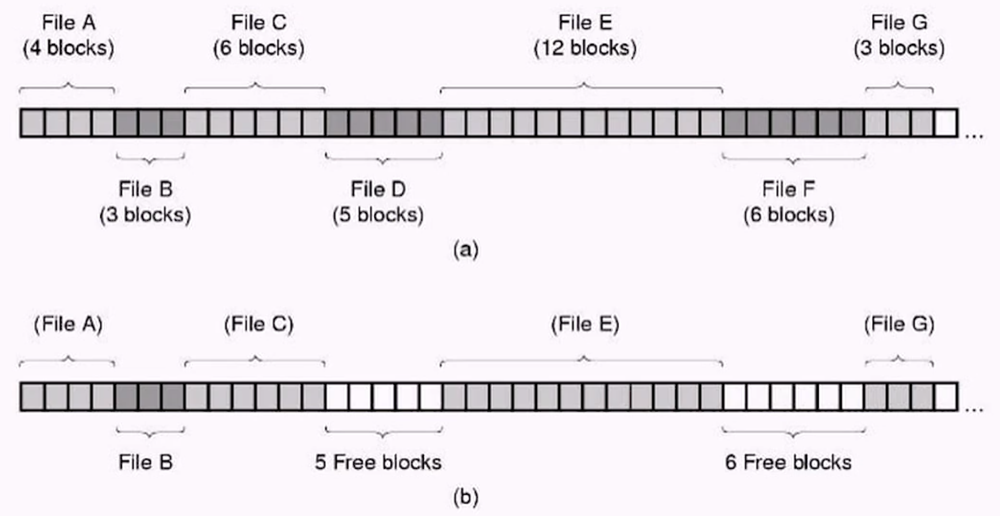
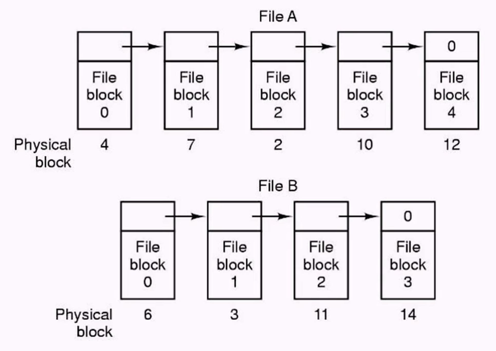
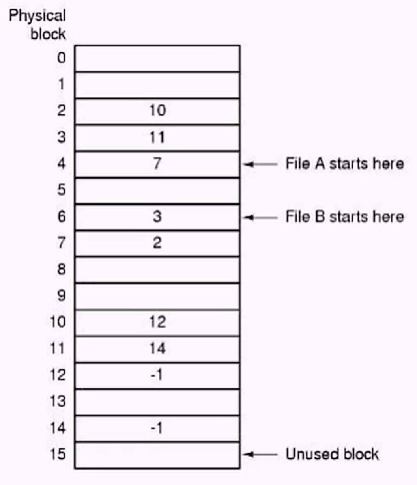
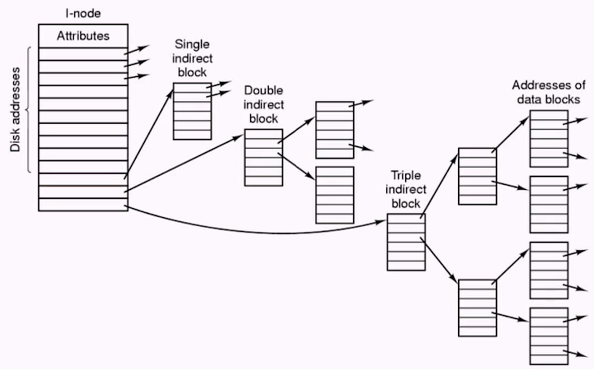
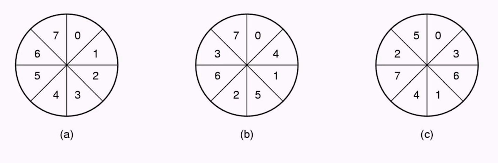

# Week 10 File Systems

- [Home](/README.md#async-table-of-contents)
- [10.1 Readings](#101-readings)
- [10.2 File Systems](#102-file-systems)
- [10.3 Contiguous File Allocation](#103-contiguous-file-allocation)
- [10.4 Inodes](#104-inodes)
- [10.5 File System Performance](#105-file-system-performance)
- [10.6 Log Structure File System](#106-log-structure-file-system)
- [10.7 Directory Implementation](#107-directory-implementation)

## Questions

## 10.1 Readings
([top](#week-10-file-systems))

*Oh*
[Chapter 5 | *File Systems*](/readings/README.md#oh-Chapter-5--file-systems)

## 10.2 File Systems
([top](#week-10-file-systems))

### Hardware Review
- Hard disks are electromechanical (mechanical == moving parts!)
  - *orders of magnitude slower than electrons moving around*
- 3 sources of delay
  - rotational
  - seek
  - data transfer

### User Perspective
- File systems provie long-term storage with files of vastly different size
- Provides nonvolatile storage (files persist between cycling power, unlike RAM)
- Multiple processes can acccess same file concurrently

### File Types
- Regular files
- Directory files
- Character special files
- Block special files

### File Operations
1. Create
2. Delete
3. Open
4. Close
5. Read
6. Write
> os responsibility

### How are files stored?
Three kinds of files
1. Byte Sequence
2. Record Sequence
3. Tree

### How can we implement directories?

## 10.3 Contiguous File Allocation
([top](#week-10-file-systems))

> a. Contiguous allocation of disk space for seven files
b. State of the disk after files D and F have been removed

### Problems
- what is this similar to?
- we encounter the same problems as contiguous memory allocation

1. Disk becomes fragmented
2. How to find a hole large enough
3. What happens if file is larger than RAM?

### Linked List

### Linked List Trade-Offs
- Advantages:
  - Each block in disk can be used (no external fragmentation)
  - Files can grow easily
- Disadvantages:
  - Stealing file room (cannot use whole block)
  - Must traverse entire list (random access file?)
- Alternative: **Keep a table in memory**

### File Allocation Table

> Linked list using a file allocaiton table in RAM

### File Allocation  Table Trade-Offs
- Advantages:
  - Can use whole block for data
  - Traversing takes place in memory now
- Disadvantages:
  - Grows in size with disk: 20 Gb disk and 1 KB block size means 20 million entries, 3 or 4 bytes a piece, 60 or 80 MB for a table
  - Must keep entire table in memory (although we can page it)

## 10.4 Inodes
([top](#week-10-file-systems))

- File allocation table is global table (one per system)
- Grows linearly with disk size
- Most files are not open at any one point in time (so why keep their information around)
- per-file table: inode

- Maps virtual block to physical file block
- Uses chaining: Last point points to another inode

### Inode Trade-Offs
- Advantages
  - Only need particular inode when that file is open
  - can make inode size one disk block
- Disadvantages
  - More complicated structure

### Single, Double, or Triple Indirect

> Unix V7 File System Inode 

## 10.5 File System Performance
([top](#week-10-file-systems))

### Problems with Common File System

- Information is spread around disk intruducing too many small accesses
  - directory  information
  - fire attributes (inode)
  - data
- A least four accesses for creating a file 
  - Inode for directory, directory data, inode for file, file data
- Synchronous write for metadata

### File System Performance
- Caching
  - much the same way as paging in VM
  - use hashing to improve access. `H(disk address)=location in cache`
  - LRU? (least recently used)
    - How about file system consistency
- Block read ahead
  - Many files are read sequentially
  - So read ahead...
  - If files are accessed randomly, doesn't help

### Reducing Disk Arm Motion
1. Place related blocks physically together
2. Arm-scheduling algorithms
3. Place "hot blocks" (inodes) in the middle

### Interleaving

> - no interleaving
> - single interleaving
> - double interleaving

### Disk-Arm-Scheduling Algorithms
- Time required to read or write a disk block determined by three factors:
  1. Seek time
  2. Rotational delay
  3. Actual transfer time
- **Seek time dominates**
- Error checking is done by controllers

### Shortest Seek First (SSF)

> How do we serialze this sequence of requests to minimize the amount of movement needed?

### Elevator Algorithm

- Move in one direction, grabing the data, until you reach the max or min of the seekable range
- Then reverse

### The Organ Pipe Distribution
- Create a histogram of the disk block usage (count the number of times that disk blocks are used)
- Place most used blocks in the middle track
- This reduces average seek time

## 10.6 Log Structure File System
([top](#week-10-file-systems))

### What are the trends?
- CPU: faster exponentially
- Disk: improvement on mostly cost and size, but no performance
- Memory: cost and size; some performance improvement

### Log Structure File Systems
- With CPUs faster, memory larger
  - disk caches can also be larger
  - increasing number of read requests can come from cache
  - thus, most disk accesses will be **writes**
- **each write is very small**
- LFS strategy structures entire disk as a log segment
  - Have allwrites initially buffered in memory
  - periodically write these to the end of the disk log
  - when file opened, locate inode, then find blocks

### How to accomplish?
- Needs large contiguous disk space...
- HD space is not infinite
- Idea: use segments and segment cleaner

### Log Structured File Systems
- A segment can contain inodes, directory blocks, data blocks, and so on
- Segment summary: at the start of each segment, telling what can be found in the segment
- Notice that inodes are scattered all over the disk

### Cleaner Process
- How often? continuously? overnight?
- How many segments to clean at one time?
- Which segment to clean? Most fragmented one?
- How do we reorganize data within segments?
  - *locality of reference*

## 10.7 Directory Implementation
([top](#week-10-file-systems))

### Directories
- From a user perspective, directories provide a way to logically organize files
- For the OS, directories provide the mapping from the human-readable filename to the location on disk of the file
- Directories can also store other file attributes (r/w, ownership, last update time, etc)
- Directories are files as well
- How do we keep track of where the directory file is stored on disk?
- Using the same mechanism as other files.
- But then how do we know where the root diretory is stored...?
- Typically stored in a special sector on disk.

### Implementing Directories

1. A simple directory
   - Fixed-size entries
   - disk addresses and attributes in directory entry
2. Directory in which each entry just refers to an inode

### Implementing Directories
- Two ways of handling long file names in directory
  - (a) Inline
  - (b) In a heap