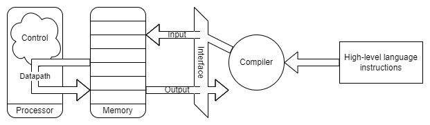

# Week 1 Introduction

- [1.1 Readings](#11-Readings)
- [1.2 The Information Revolution](#12-The-Information-Revolution)
- [1.3 Program Performance](#13-Program-Performance)
- [1.4 Under the Covers](#14-Under-the-covers)
- [1.5 Processor and Memory](#15-processor-and-memory)
- [1.6 Performance](#16-Performance)
- [1.7 Power and Parallelism](#17-power-and-parallelism)

## 1.1 Readings
[top](#week-1-Introduction)

*Patterson and Hennesy*
[Chapter 1 | *Computer Abstractions and Technology*](/readings/README.md#Chapter-1--Computer-Abstractions-and-Technology)

## 1.2 The Information Revolution
[top](#week-1-Introduction)
1. **Agricultural Revolution** 10,000 B.C.
2. **Industrial Revolution** 18th century
3. **Information Revolution** (20th and 21st century)

### Classes of Computers
- Personal Computers
  - General Purpose, variety of software
  - Subject to cost/performance trade-fss
- Server computers
  - Network-based
  - high cpacity, perfomance, reliability
  - Small to building-sized
- Super computers
  - High-end scientific and engineering calculations
  - small fraction of market
- Embedded computers
  - Hidden as components of systemms
  - Tight power/performance constraints

*Are smart phones personal computers or super computers? Or are they server computers*

### Post-PC Era
- Perosonal mobile devices (smartphone, tables, etc)
  - battery-operated
  - connects to internet
  - cheap (100s of dollars)
- Cloud computing
  - Warehouse-scale computing
  - Software sa a Service (SaaS)
  - Portion of software runs on PMD, portion runs in the cloud
  - Amazon and Google

### Moore's Law
- Progress in computing technology is underpinned by Moore's law
- **Moore's law**: number of transistors double every two years (or 18 months)
  - (the speed of the processor)
- Attributed to Gordon Moore, cofounder of Intel, in 1965
- Lasted until about 2012, now about 2.5 years, should last until late 2017 at the 10 nm scale.

|Decimal Term|Abbreviation|Value|Binary Term|Abbreviation|Value|% Larger|
|---|---|---|---|---|---|---|
|kilobyte|KB|103|kibibyte|KiB|210|2%|
|megabyte|MB|106|mebibyte|MiB|220|5%|
|gigabyte|GB|109|gibibyte|GiB|230|7%|
|terabyte|TB|1012|tebibyte|TiB|240|10%|
|petabyte|PB|1015|pebibyte|PiB|250|13%|
|exabyte|PB|1018|exibibyte|EiB|260|15%|
|zettabyte|ZB|1021|zebibyte|ZiB|270|18%|
|yottabyte|YB|1024|yobibyte|YiB|280|21%|

## 1.3 Program Performance
[top](#week-1-Introduction)
### Below Your Program
- Application software (**program**)
  - Written in high-level language
- System Software
  - **Compiler**: translates HLL to machine code
  - **Operating System**: service code
    - Handling I/O (Input/Output)
    - Managing memory and storage
    - Cheduling tasks and sharing resources
- Hardware

### Levels of Program Code
- High-level language (C/C++, Java, etc)
  - Level of abstraction closer to problem domain
  - Provides for productivity and portability
- Assembly language
  - Textual representation of instructions
- Hardware representation
  - Binary Digits (bits)
  - Encoded instructions *and* data
  
### Program Performance
- **Algorithm** recipe to solve a problem
  - A **Program** can be thought of as an implementation of an algorithm in a specific language.
  - Determines the number of operations executed
- **Compiler**
  - Determine the number of machine instructions
- Processor and memory system
  - Determine how fast instructions are executed
- I/O system (including OS)
  - Determines how fast IO operations are executed

## 1.4 Under the Covers
[top](#week-1-Introduction)
### Abstract Components of a Computer
Five classic components of a computer:

1. Input
2. Output
3. Memory
4. Datapath
5. Control

### Computer Hardware Terminology
- **Motherboard**: The main printed circuit board
  - Connect to IO
  - Memory
  - CPU
- **Memory (RAM)**: Where programs are kept along with their needed data
- **Centra Processing Unit (CPU)**: Follows instructions of programs: Adds numbers, tests numbers, signals I/O devices and so on

### Inside the Processor (CPU)
- **Datapath**: Performs arithmetic operations on data
- **Control**: Sequences datapath, memory, IO devices
- **Cache Memory**: Small, fast SRAM memory for immediate access to data

### A Safe Place for Data
- Volatile main memory
  - Loses data when power turns off
- Nonvolatile secondary memory
  - Magnetic disk
  - Flash memory
  - Optical disks (CD-ROM, DVD)

### Networks
- Communication, resource sharing, nonlocal access
- Local area network (LAN): Ethernet
- Wide area network (WAN): The Internet
- Wireless network: WiFi, Bluetooth

### Instruction Set Architecture
- The ISA (of architecture) of a machine informs programmers how to make a binary program work correctly. This is the **interface** between hardware and  low-level software
- The basic instruction set and the operating system interface are called the **application binary interface**
- The implementation of computer hardware needs to adhere to the architecture abstraction

## 1.5 Processor and Memory
[top](#week-1-Introduction)
### Processor Technologies
- **Vacuum tube**: Hollow, airless glass tube electron beam to transfer data; *predecessor of transistor*
- **Transistor**: An on/off switch controlled by electric signal
- **Integrated Circuit**: Combines dozens to hundreds of transistors on a single chip
- **Very large-scale integrated circuit (VSLI)**: Millions of transistors

### Memory Technology
- **Static Random Access Memory (SRAM)**: CPU Cache, more expensive, volotile, quick
  - Subset of RAM used more frequently
- **Dynamic Random Access Memory (DRAM)**: Volatile, slower than SRAM.
  - Main memory RAM
- Growth of DRAM capacity
- slower than processor capacity
- 20 years to improve from 1M to 1G Kbit capacity

### Manufacturing a Chip
- Silicon: Substance found in sand; is a **semiconductor** (not a good conductor)
- Add materials to transform properties
  1. Conductors: Using microscopic copper or aluminum wire
  2. Insulators: Plastic sheething or glass
  3. Switches: Areas that conduct OR insulate under special conditions

### Chip Manufacturing Process
- **Wafer**: slice of silicon ingot less than 0.1 inch thick
- A single microscopic flaw (**defects**) in a wafer can result in failure
- Put multiple independent components on a single wafer
- The patterned wafer is diced into these components (**dies**)
- Only discard dies that contain flaws
- **Yield** is the percentage of good dies from the wafer

### Integrated Circuit Cost

>cost per die = cost per wafer/(dies per wafer * yield)
dies per wafer &approx; wafer area/die area
yield = 1/(1+(defects per area * (die area/2)))2

- Nonlinear relation to area and defect rate
  - Wafer cost and area are fixed
  - Defect rate determined by manufacturing process
  - Die area determined by architecture and circuit design

## 1.6 Performance
[top](#week-1-Introduction)
### Response Time and Throughput
- **Response time**: How long it takes to do a task; time between start and end
- **Throughput**: Total work done per unit time
- How are response time and throughput affected by:
  - *Replacing the processor with a faster version?*
    - Response time increases with throughput
  - *Adding more processors?*
    - May increase throughput but not necessarily response time
  - *Does increasing one necessarily increase the other?*

### Relative Perfomance
- Define Performance `1/Execution Time`
- X is N-times faster than Y

>Perfomancex/Performancey = Execution Timey/Execution Timex

- Example:
  - 10ms on A, 15ms on B
  - 15ms/10ms = 1.5
  - So A is 1.5 times faster than B

### Measuring Execution Time
- Elapsed time
  - Total response time, including all aspects
    - Processing, IO, OS Overhead, idle time
  - Determines system performance
- CPU Time
  - Time spent processing a given job
    - Discounts IO, other jobs's shares
  - Comprises user CPU time and system CPU time
  - Different programs are affected differently by CPU and system performances

### CPU Clocking
- Operation of digital hardware governe by a constant rate clock
- Clock period = duration of a clock cycle
  - E.g., 250ps = 0.25ns = 250x10-12s
- Clock frequency (rate): cycles per second
  - E.g., 4.0GHz = 4000MHz = 4.0x109

### CPU Time
>CPU Time = CPU Clock Cycles x Clock Cycle Time = CPU Clock Cycles/Clock Rate

- Performance improved by
  - Reducing number of clock cycles
  - Increasing clock rate
  - Hardware designer must often trade off clock rate against cycle count

### Example: CPU Time
- Computer A: 2GHz clock, 10s CPU time
- Designing computer B
  - Aim for 6s CPU time
  - Can do faster clock, but causes 1.2 X clock cycles of computer A

> ClockRateB = ClockCyclesB / CPUTimeB = (1.2 &times; ClockCyclesA) / 6s

> ClockCyclesA = CPUTimeA &times; ClockRateA = 10s &times; 2GHz = 20&times;109

>ClockRateB = (1.2 &times; 20 &times; 109) / 6s = (24x109) / 6s = 4GHz

### Instruction Count and CPI
- **Cycles Per Instruction (CPI)**
- Instruction count for a program
  - Determined by program, ISA (Instruction Set Architecture) and compiler
- Average cycles per instruction
  - Determined by CPU hardware
  - If different instructions have different CPI
    - Average CPI affected by instruction mix
> Clock Cycles = Instruction Count &times; Cycles per Instruction

> CPU Time = Instruction Count &times; CPI &times; Clock Cycle Time = Instruction Count &times; CPI / Clock Rate

### Example CPI
- Same ISA
  - Computer A: cycle time = 250ps, CPI=2.0
  - Computer B: cycle time = 500ps, CPI=1.2
- Which is faster, and by how much?
  - Let P be the instruction count for a given program.
> CPUTimeA = InstructionCount &times; CPIA &times; CycleTimeA

> CPUTimeB = InstructionCount &times; CPIB &times; CycleTimeB

>CPUPerformanceA/CPUPerformanceB = CPUTimeB / CPUTimeA = 600ps &times; P / 500ps &times; P = 1.2

### More CPI (Instruction Mix)
- If different instruction classes take different numbers of cycles, then we count CPI and number of instructions per class:
> Clock Cycles = &sum;ni=1(CPIi &times; Instruction Counti)

## 1.7 Power and Parallelism
[top](#week-1-Introduction)

### Power
- In CMOS IC technology
  - Power = Capacitive Load &times; Voltage2 &times; Frequency
  - Capacitive Load: Energy needed for charging and releasing a capacitor
- Relative Power
  - New CPU with 85 percent of capacitive load, 15% voltage and 15% frequency reduction

> Pnew/Pold = (Cold&times;0.85&times;(Vold&times;0.85)2&times;Fold&times;0.85) / (Cold&times;Vold2&times;Fold) = 0.854

### Fallacy: Low Power at Idle
- Look back at i7 power benchmark
  - At 100 percent load: 258W
  - At 50 percent load: 170W (66 percent)
  - At 10 percent load: 121W (47 percent)
- Google data center
  - Mostly operates at 10-50 percent load
  - At 100% load less than 1 percent of the time
- Consider designing process to make power proportional to load

### Multiprocessors
- Multicore microprocessors
  - More than one processor per chip
- Requires explicitly parallel programming
  - Compare with instruction-level parallelism
  - Hidden from programmer
- Hard to do
  - Programming for performance
  - Load balancing
  - Optimizing communication synchronization

### Pitfall: Amdahl's Law
- Improving an aspect of a computer and expecting a proportional improvement in overall performance

> Timproved = (Taffected/Improvement Factor) + Tunaffected

- Example: multiple operation accounts for 80s out of 100s
  - How much improvement in performance to get 5x overall?
- Corollary: **Make the commom case fast**