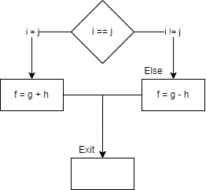
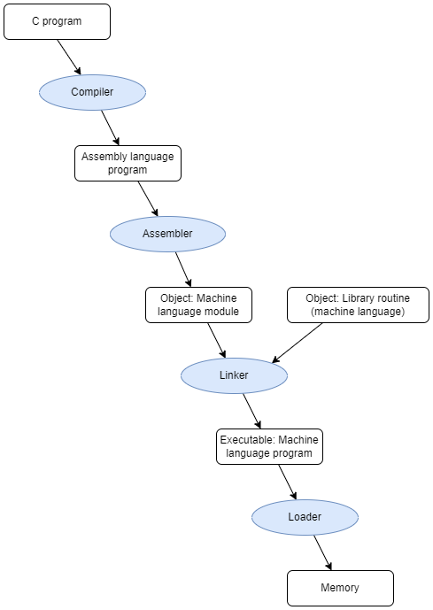

# Week 3 Instructions 2
- [Home](/README.md)
- [3.1 Readings](#31-Readings)
- [3.2 Conditional Operations](#32-conditional-operations)
- [3.3 Procedures](#33-procedures)
- [3.4 Translation and Startup](#34-translation-and-startup)
- [3.5 Sorting Example](#35-sorting-example)

## Questions
- Are linkers similar to linked lists? The slide on lazy linking.
- Any limits on label length

## 3.1 Readings
([top](#week-3-Instructions-2))

*Patterson and Hennesy*
[Chapter 2 | *Instructions: Language of the Computer*](/readings/README.md#Chapter-2--Instructions-Language-of-the-computer)

## 3.2 Conditional Operations
([top](#week-3-Instructions-2))


### Branch if (not) equal
- Branch to a labeled instruction if a condition is true
  - Otherwise, continue sequentially
- `beq rs, rt, L1 # branch if equal`
  - if (rs==rt) branch to instruction labeled L1
- `bne rs, rt, L1 # branch if not equal`
  - if (rs!=rt) branch to instruction labeled L1
- `j L1`
  - unconditional jump to instruction labeled L1

### Compiling IF statements

- C code;
```C
if (i == j) f = g + h;
else f = g - h;
// f, g, h in $s0, $s1, $s2
```

- Compiled MIPS code:
```
  bne $s3, $s4, Else
  add $s0, $s1, $s2
  j Exit
Else: sub $s0, $s1, $s2 # Else is serving as a label
Exit: ... # Exit is label
```


Above compiled the `if` statement into `bne`. What if it were beq?
```
  beq $s3, $s4, If
  sub $s0, $s1, $s2 # swap if and else labels
  j Exit
If: add $s0, $s1, $s2
Exit: ...
```

#### Assuming x is in $s0 and y is in $s1, which answer correctly captures the semantics of the following C code?

```C
if (x > y) {
  y++;
} else {
  y--;
}
```

```
slt $t0, $s1, $s0 # t0 = 1 IFF y < x.
beq $t0, $00, else # If $t0 = 0 jump to else statement.
addi $s1, $s1, 1  # $t0 = 1 on this line, so y < x is true, increment y.
j end             # Needed to ensure we don't execute both if-body and else-body.
else:             # Else label.
addi $s1, $s1, -1 # Decrement y since y is not less than x.
end:              # Next line after if-statement.
```

### Compiling Loop Statements
- C code:
```C
while (save[i] == k) i += 1;
// i in $s3, k in $s5, address of save in $s6
```
- Compiled MIPS code
```
Loop: sll $t1, $s3, 2     # multiple 2*2 = 4, 
      add $t1, $t1, $s6   # position of i (the index i of save)
      lw $t0, 0($t1)      # copying out of array into register $t0
      bne $t0, $s5, Exit  # $t0 is save[i], $s5 is k. if save[i]!=k jump to exit
      addi $s3, $s3, 1    # increment i
      j Loop              # jump to loop (it's a loop)
Exit...
```

#### Assuming i is in $s0, which answer correctly captures the semantics of the following C code?

```C
while (i > 0) {
  i *= 2;
}
```

```
loop:            # A label to jump back to. 
slt $t0, $0, $s0 # $t0 = 1 IFF 0 < x.
beq $t0, $0, end # $t0 = 0 IFF 0 >= x (so exit loop).
sll $s0, $s0, 1  # Execute loop body (x *= 2).
j loop           # repeat loop.
end:             # # a label to jump to when loop is done.
```

### Basic Blocks
- A basic block is a sequence of instruction with
  - No embedded branched (except and end)
  - No branch targets (except at beginning)
- A compiler identifies basic blocks for optimization
- An advanced processor can accelerate execution of basic blocks

### More Conditional Operations
- Set result to 1 if a condition is true
  - Otherwise set to 0
- `slt`
```
slt rd, rs, rt #
```
```C
if (rs < rt) rt = 1;
else rt = 0;
```
- `slti`
```
slti rt, rs constant
```
```C
if (rs < constant) rt = 1;
else rt = 0;
```
- Use in combination with beq, bne
- "branch if less than"
```
slt $t0, $s1, $s2  # if ($s1 < $s2)
bne $t0, $0, L  # branch to L
```

### Branch instruction design
- why not blt, bge, and so on?
- Hardware for <, &ge;,..slower than =, <>
  - Combining with branch involves more work per instruction, requiring a slower clock
  - all instructions are penalized!
- beq and bne are the common case
- This is a good design compromise

### Signed vs Unsigned
- signed comparrison: `slt, slti`
- unisigned comparison: `sltu, sltui`
- example
```
$s0 = 1111 1111 1111 1111 1111 1111 1111 1111 = -1
$s1 = 0000 0000 0000 0000 0000 0000 0000 0001 = 1
```
```
slt $t0, $s0, $s1 # signed
```
- -1 &lt; +1 &rArr; $t0 = 1
```
sltu $t0, $s0, $s1 # unsigned
```
- +4,294,976,295 &lt; +1 &rArr; $t0 = 0

## 3.3 Procedures
([top](#week-3-Instructions-2))

### Procedure Calling
- Steps
  1. Place parameters in registers
  2. Transfer control to procedure
  3. Acquire storage for procedure
  4. Perform procedure's operations
  5. Place result in register for caller
  6. Return to place of call

### Register Usage
|Name|Register #|Usage|Reserved on call?|
|:---|:---|:---|:---|
|`$zero`|0|Constant 0|n.a.|
|`$v0-$v1`|2-3|Value results for expression evaluation|no|
|`$a0-$a3`|4-7|Arguments|no|
|`$t0-$t7`|8-15|Temporaries|no|
|`$s0-$s7`|16-23|Saved|yes|
|`$t8-$t9`|24-25|More temporaries|no|
|`$gp`|28|Global pointer|yes|
|`$sp`|29|Stack pointer|yes|
|`$fp`|30|Frame pointer|yes|
|`$ra`|31|Return address|yes|

### Procedure Call Instructions
- Procedure call: jump-and-link
  - `jal ProcedureLabel`
  - address of following instruction put in `$ra`
  - jumps to target address
- Procedure return: jump-register
  - `jr $ra`
  - copies `$ra` to program counter
  - can alos be used for computed jumps
  - e.g. for case/switch statements

#### Question
> Which of the following code snippets demonstrates how to make a function call,
assuming that x is in `$s0`, a is in `$s1` and b is in `$s2`?
`int x = min(a, b);`

```
addi $a0, $s1, 0 # Set the first parameter to a
addi $a1, $s2, 0 # Set the second parameter to b
jal min # Call the function min
addi $s0, $v0, 0 # Store the result into the v0 register.
```

### Leaf Procedure Example [1]
C code:
```C
int leaf_example(int g, int h , int i, int j){
  int f;
  f = (g+h) - (i+j);
  return f;
}
```
- arguments g,...,j in `$a0`,...,`$a3`
- f in `$s0` (hence, need to save `$s0` on stack)
- Result in `$v0`

### Leaf Procedure Example [2]
Mips code:
```
leaf example:          # prcedure label

  addi $sp, $sp, -4    #
  sw $s0, 0($sp)       # save $s0 on stack

  add $t0, $a0, $a1    #
  add $t1, $a2, $a3    #
  sub $s0, $t0, $t1    # procedure body

  add $v0, $s0, $zero  # result

  lw $s0, 0($sp)       # 
  addi $sp, $sp, 4     # restor $s0

  jr $ra               # return
```
- *everything will be in the same state at the end, except `$v0` will have the result value of the procedure*
- Stack grows "down" and heap grows "up" with size


#### Question
> Which of the answers captures the semantics of the following C function:
> ```
> int min (int x, int y) {
>   if (x < y) return x;
>   return y;
> }
> ```

```
min:             # function label.
  slt $t0, $a0, $a1          # t0 = x < y.
  beq $t0, $0, false         # t0 = 0 -> x >= y (return y).
  addi $v0, $a0, 0           # return x.
  jr $ra                     # return to caller
false:                       # label for returning y.
  addi $v0, $a1, 0           # set return value to y.
  jr $ra                     # return to caller
```

## 3.4 Translation And Startup
([top](#week-3-Instructions-2))



### Assembler Pseduo-Instructions
- most assembler instructions represent machine instructions one-to-one
- pseduo-instructions: figments of the assember's imagination

```
move $t0, $t1   -> add $t0, $zero, $t1
blt $t0, $t1, L -> slt $at, $t0, $t1 bne $at $zero, L
```
- `$at` (register 1): assembler temporary

### Producing an Object Module
- Assembler (or compiler) translates program into machine instructions
- Provides information for building a complete program from pieces
  - **Header**: described contents of object module
  - **Text Segment**: translated instructions
  - **Static Data Segment**: data allocated for the life of the program
  - **Relocation information**: for contents that depend on absolute location of loaded program
  - **Symbol Table**: global definitions and external refs
  - **Debug Information**: for associating with source code

### Linking Object Modules
- Produces an executabe image
  - Merge segments
  - Resolve labels (determine their addresses)
  - Patch location-dependent and external references
- Could leave locatoin dependencies for fixing by relocating loader
  - But with virtual memory, no need to do this
  - Program can be loaded into absolute location in virtual memory space

### Loading a Program
Load from image file on disk into memory
1. Read header to determine segment size
2. Create virtual address space
3. Copy text and initialized data into memory
4. Or set page table entries so they can be faulted (copied) in
5. Set up arguments on stack
6. Initialize registers (including `$sp`, `$fp`, `$gp`) 
7. Jump to startup routine
    - copies arguments to `$a0`, ... and calls main
    - When main returns, do exit syscall
  
### Dynamic Linking
Only link/load library procedure when it is called
- Requires procedure code to be relocatable
- Avoids image bload caused by static linking of all (transitively) referenced libraries
- Automatically picks up new library versions

### Lazy Linking
- Indirection Table
- Stub: Loads routine ID, jump
- Linker/loader code
- Dynamically mapped code

## 3.5 Sorting Example
([top](#week-3-Instructions-2))

### Sort Example
- Illustrates use of assembly instructions for a C bubble sort function
- swap procedure (leaf)

```C
void swap(int v[], int k){
  int temp;
  temp = v[k];
  v[k]=v[k+1];
  v[k+1]=temp;
}
```
- `$0` v
- `$a1` k
- `$t0` temp

### The Procedure Swap
```
##### Procedure Body#####
swap:
      sll $r1, $a1, 2    # reg $t1 = k * 4
      add $t1, $a0. $t1  # reg $t1 = v + (k * 4)
                         # reg $t1 has the address of v[k]
      lw  $t0. 0($t1)    # reg $t0 (temp) = v[k]
      lw  $t2, 4($t1)    # reg $t2 = v[k+1]
                         # refers to next element of v
      sw  $t2, 0($t1)    # v[k] = reg $t2
      sw  $t0, 4($t1)    # v[k+1] = reg $t0 (temp)

##### Procedure Return #####

      jr  $ra            # return to calling routine
```

### Sort Procedure
```C
void sort(int v[], int n){
  int i,j;
  for(i = 0; i < n; i+=1){
    for(j = i-1; j >= 0 && v[j] > v[j+1]; j-=1){
      swap(v,j);
    }
  }
}
```

### Procedure Body

- `$s0` i
- `$s1` j
- `$s2` v
- `$s3` n
```
##### move parameters #####
move $s2, $a0                       # copy parameters $a0 into $s2 (save $a0)
move $s3, $a1                       # copy parameter $a1 into #s3 (save $a1)

##### outer loop #####
######################
move $s0, $zero                     # i=0
for1tst: lst $t0, $s0, $s3          # reg $t0=0 if $so
         beq $t0, $zero, exit1      # got to exit1 if $s0<$s3 (i<n)

##### inner loop #####
######################
addi $s1, $s0, -1                   # j=i-1
for2tst:  slti $t0, $s1,0           # reg $t0=1 if $sl<0 (j<0)
          bne  $t0, $zero, exit2    # go to exit2 if $s<0 (j<0)
          sll  $t1, $s1, 2          # reg $t1 = j*4
          add  $t2, $s2, $t1        # reg $t2=v+(j*4)
          lw   $t3, 0($t2)          # reg $t3=v[j]
          lw   $t4, 4($t2)          # reg $t4=v[j+1]
          slt  $t0, $t4, $t3        # reg $t0=0 if $t4<$t3
          beq  $t0, $zero, exit2    # go to exit 2 if $t4<$t3

##### pass parameters to call #####
###################################
move $a0, $s2                       # 1st parameter of swap is v (old $a0)
move $a1, $s1                       # 2nd parameter of swap is j
jal  swap                           # swap code shown in figure 2.25

##### inner loop #####
######################
addi $s1, $s1 -1                     # j-=1
j    for2tst                         # jump to test of inner loop

##### outer loop #####
######################
exit2: addi $s0, $s0, 1              # i+=1
       j for1tst                     # jump to test of outer loop
```

### Sort Entry and Exit
```
##### saving registers #####
############################
sort: addi $sp, $sp, -20              # make room on stack for 5 registers
      sw   $ra, 16($sp)               # save $ra on stack
      sw   $s3, 12($sp)               # save $s3 on stack
      sw   $s2, 8($sp)                # save $s2 on stack
      sw   $s1, 4($sp)                # save $s1 on stack
      sw   $s0, 0($sp)                # save $s0 on stack


##### restoring registers #####
###############################
exit1: lw   $s0, 0($sp)               # restore $s0 from stack
       lw   $s1, 4($sp)               # restore $s1 from stack
       lw   $s2, 8($sp)               # restore $s2 from stack
       lw   $s3, 12($sp)              # restore $s3 from stack
       lw   $s4, 16($sp)              # restore $ra from stack
       addi $sp, $sp, 20              # restore stack pointer

##### procedure return #####
############################
jr $ra                                # return to calling routine
```