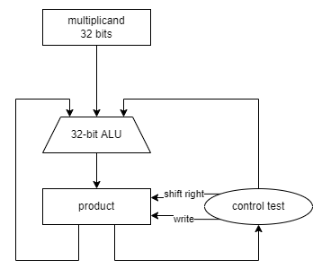
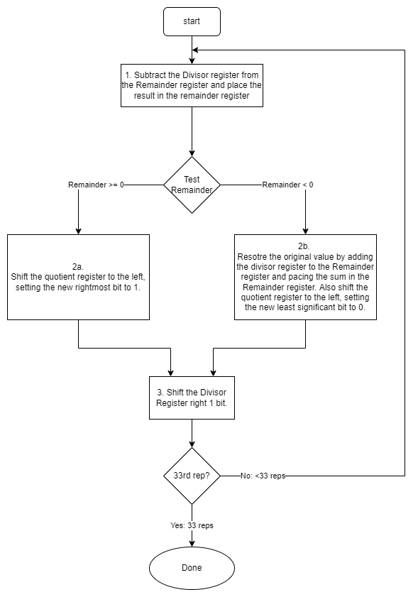
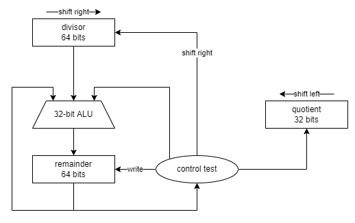

# Week 4 Arithmetic for Computers
- [Home](/README.md)
- [4.1 Readings](#41-readings)
- [4.2 Addition and Subtraction](#42-addition-and-subtraction)
- [4.3 Multiplication](#43-multiplication)
- [4.4 Division](#44-division)

## 4.1 Readings
([top](#week-4-arithmetic-for-computers))

*Patterson and Hennesy*
[Chapter 3 | *Arithmetic for Computers*](/readings/README.md#Chapter-3--arithmetic-for-computers)

## 4.2 Addition and Subtraction
([top](#week-4-arithmetic-for-computers))
> a look at the hardware involved in implementing addition and subtraction

### Binary Addition and Subtraction
|+|0|1|
|:-|:-|:-|
|**0**|0|1|
|**1**|1|1 0|

`1+1=2, carry the 1`

|-|0|1|
|:-|:-|:-|
|**0**|0|1 1|
|**1**|1|0|

`0-1=-1, borrow the 1`

### Addition
- digits are added bit-by-bit from right to left
- Carries passed to the next eft bit (as you would by hand)

- example 7+6 (carries are in parentheses below)
```
(0) (0) (1) (1) (0)
0 ^ 0 ^ 0 ^ 1 ^ 1 ^ 1
0 | 0 | 0 | 1 | 1 | 0
--|---|---|---|---|--
0(0)0(0)1(1)1(1)0(0)1
```

### Subtraction
- subtraction can occur directly
- recall that: `0000-0001=1111` in two's complement
  -  (it's signed)
- example: 7&minus;6

```
0000 0111 #7
0000 0110 #6
---------
0000 0001 #1
```

### Subtraction (by Addition)
- if two's complement we can negate the sign and perform addition.
  - flip bits and add to negativ number
- example `7 + (-6)`
```
0000 0000 0000 0000 0000 0000 0000 0111
1111 1111 1111 1111 1111 1111 1111 1010
---------------------------------------
0000 0000 0000 0000 0000 0000 0000 0001
```

### Overflow
- **overflow** occurs when a result cannot be represent in the available hardward
- when adding operands of different signs overflow cannot happen, why?
- Sum can be no larger than the operands.
- when substracting operand of the same sign overflow cannot happen. Why?

- `c-a = c+(-a)`

### How to Detect Overflow?
- Can we add two positive values but result is negative?

|Operation|Operand A|Operand B|Result indicating overflow|
|:-:|:-:|:-:|:-:|
|A+B |&ge;0 |&ge;0 |&lt;0 |
|A+B |&lt;0 |&lt;0 |&ge;0 |
|A-B |&ge;0 |&lt;0 |&lt;0 |
|A-B |&lt;0 |&ge;0 |&ge;0 |


### Dealing with Overflow
- MIPS has two sets of operations
  - `add`, `addi`, `sub` cause exceptions
  - `addu`, `addiu`, `subu`, do not cause exceptions
- C ignores overflows, C compilers generate *u instructions (addu, etc)
- Fotran and Ada require the programmer to be notified.
- MIPS sends an exception (or interrupt), which can run an unscheduled procedure to try to recover from an overflow.

## 4.3 Multiplication
([top](#week-4-arithmetic-for-computers))

```
    1000  #muliplicand
  X 1001  #multiplier
    ____
    1000
   0000
  0000
 1000
 _______
 1001000  #product
```
- The product of an n-bit number * a m-bit number requires n+m bits... overflow is an issue!

### Multiplication Algorithm
- for each digit of the multiplier
  - if the digit is 1, put a copy of the multiplicand bit shifted by the index of the multiplier digit
  - if the digit is 0, place 0 in the appropriate location
- Add all intermediate results
- What about sign??
  - `(-1) * (-1) = ?`

### Performance
- if each step in the flow diagram takes one clock cycle, multipling two 32-bit numbers could be 100 clock cycles

> 
>
> division hardware

- perform add/shift in parallel, one clock cycle per bit.

### Mutiple Adders
- do all of the muultiplies (ANDs) at the same time
- then just 32 adds
- Organize adds into a tree, then it's just log(32) times
- throw a lot of hardware at the problem

### MIPS Multiplication
- Two 32-bit registers for product
  - HI: most-significant 32 bits
  - LO: least-significant 32 bits
- Instructions
  - `mult rs, rt`/`multu rs, rt`
    - 64-bit product in HI/LO
  - `mfhi rd`/`mflo rd`
    - move from HI/LO to rd
    - can test HI value to see if product overflows 32 bits
  - `mul rd, rs, rt`
    - least-significant 32 bits of product &rarr; rd

## 4.4 Division
([top](#week-4-arithmetic-for-computers))

### Division
- Check for 0 divisor
- Long-division approach
  - If divisor &le; dividend bits
    - 1 bit in quotient, subtract
  - Else
    - 0 bit in quotient, bring down next dividend bit
- Restoring division
  - Do the subtract, and if remainder goes < 0, add divisor back
- Signed division
  - Divide using absolute values
  - Adjust sign of quotient and remainder as required
- `divisor / dividend = quotient & remainder`

### Division Algorithm
- The remainder register is initialized with the dividend

> 
>
> division algorithm

> 
>
> division hardware

### Improved Division
- Shift the operands and quotient simultaneously
- Looks similar to multiplication
- Can use same hardware for both!


### Faster Division?
- Can't use parallel hardware as in multiplier
  - subtraction is conditional on sign of remainder
- Faster dividers (e.g. SRT division) generate multiple quotient bits per step
  - still require multiple steps

### MIPFS Division
- USE HI/LO registers for result
  - HI: 32-bit remainder
  - LO: 32-bit quotient
- Instructions
  - `div rs, rt`
  - `divu rs, rt`
  - no overflow or divide-by-0 checking
    - software must perform checks if required
  - use `mfhi`, `mflo` to access result
