# Week 5 The Processor
- [Home](/README.md#async-table-of-contents)
- [5.1 Readings](#51-readings)
- [5.2 The Processor](#52-the-processor)
- [5.3 Logical Design](#53-logical-design)
- [5.4 Building a Datapath](#54-building-a-datapath)
- [5.5 ALU Control](#55-alu-control)

## Questions
- Why do we shift left by 2 on the branch instruction? Not clear.
- In a datapath, where do we start? Instruction memory?

## 5.1 Readings
([top](#week-5-the-processor))

*Patterson and Hennesy*
[Chapter 4 | *The Processor*](/readings/README.md#Chapter-4--the-processor)

## 5.2 The Processor
([top](#week-5-the-processor))

### MIPS Subset
- Hardware implementation for a subset of MIPS
  1. Memory references: Load/Store
  2. Arithmetic/Logical: `add`, `sub`, `AND`, `OR`, `slt`
  3. Branching: `beq`, `jump`
- Not all arithmetic instructions (no multiple divide, shift)
- No floating point math

### Instruction Execution Step
1. PC (program counter) &rarr; instruction memory, fetch instruction
   - PC holds the address of the instruction
2. Register numbers &rarr; register file, read registers
3. Depending on instruction class
   - use [ALU](/vocab/README.md/#Arithmetic-Logic-Unit) to calculate
     1. Arithmetic result
     2. Memory address for load/store
     3. Branch target address
4. Access data memory for load/store
5. PC &larr; target address or PC + 4
   - update pc

### MIPS Data Flow

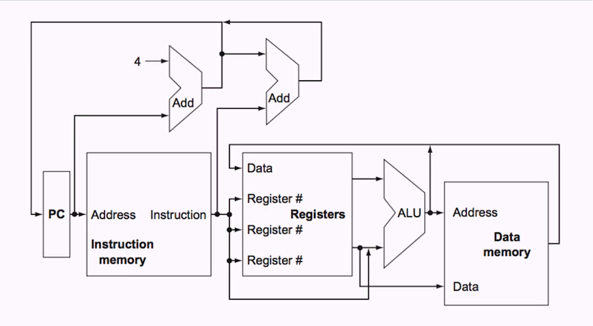

### With Control

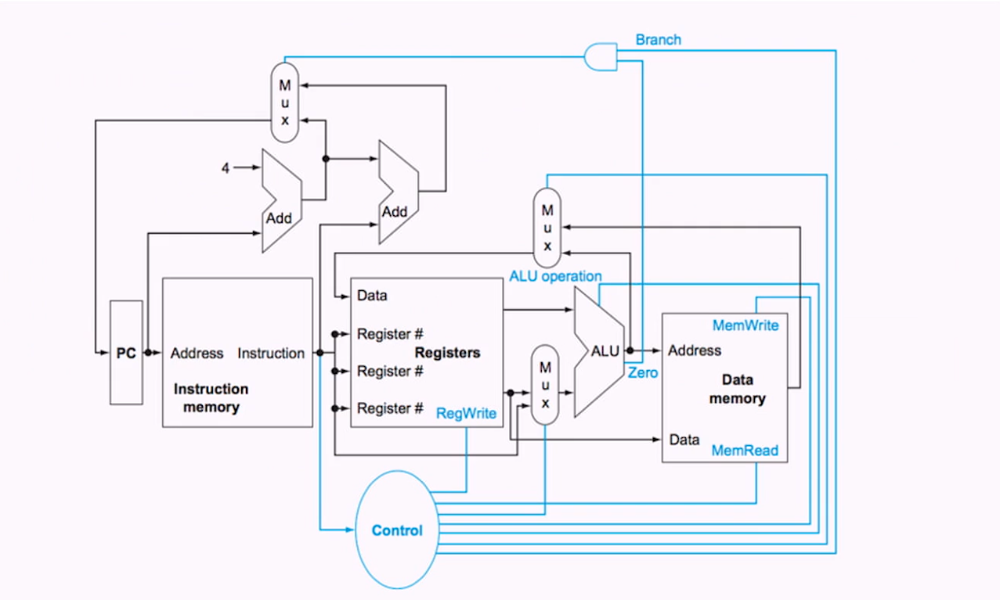

## 5.3 Logical Design
([top](#week-5-the-processor))

### Logical Elements
- **Combinational Elements** Output depends only upon their current inputs
  - Examples: ALU, Adder, Mutliplexer
- **State (sequential) elements** Has an internal state that impacts its output
  - Examples: Instruction and data memory, registers
  - Has two inputs:
    - Data: value to be written
    - Clock: determines when data are written

### Clocking Methodology
- **Clocking methodology** Defines when read and writes can happen
  - If a value is read and written at the same time, result could be some mix of new and old (or either).
  - Makes hardware predictable
- **Edge-triggered clocking** Sequential elements are updated only on a clock edge (transition from low to high or vice versa)

### Sequential Elements
- Register: stores data in a circuit
  - uses a clock signal to determine when to update the stored value.
  - Edge-triggered: update when clock changes from 0 to 1

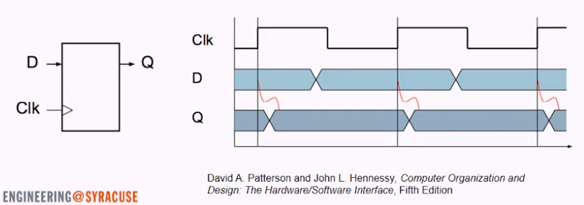

- Register with write control
  - Only updates on clock edge when write control input is 1
  - Used when stored value is required late

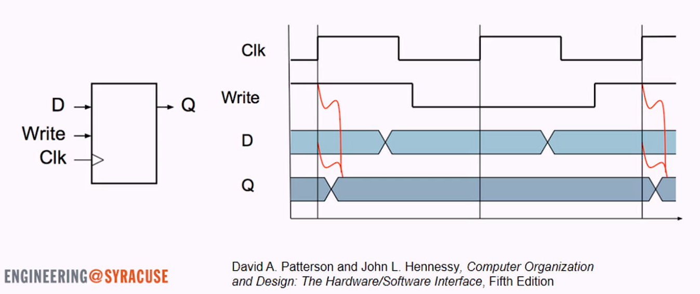

### Clocking Methodology
- Combinational logic transforms data during clock cycles
  - between clock edges
  - input from state elements, output to state element
  - longest delay determine clock period

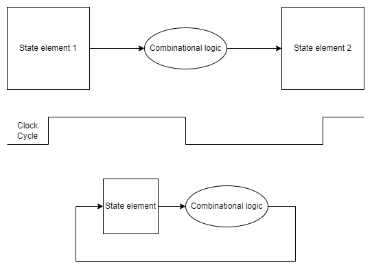

## 5.4 Building a Datapath
([top](#week-5-the-processor))

- Datapath
  - elements that process data and addresses in the CPU
    - Registers, ALUs, muxs, memories
  - how data moves around within the CPU

### Instruction Fetch

(common for all instructions)
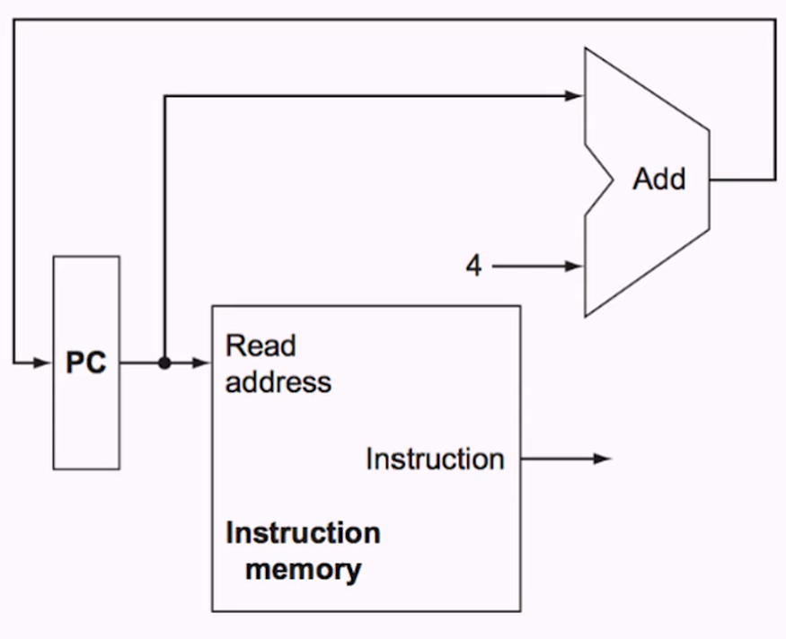

### R-Format Instructions
- read two register operands
- perform artihmetic/logical operation
- write register result

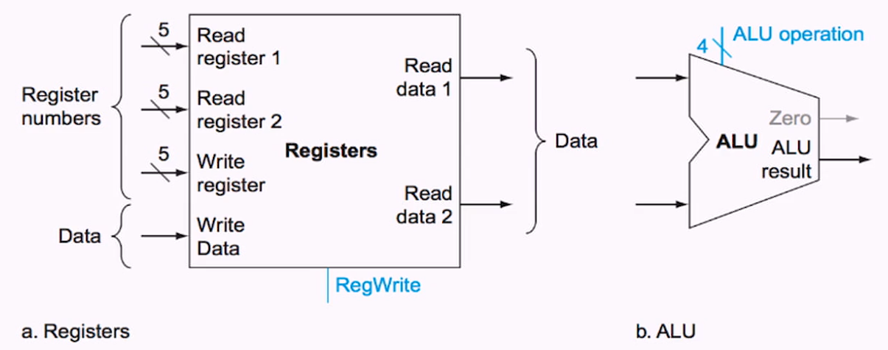
- ALU zero output
  - 1 if ALU is zero
  - 0 if ALU is non-zero

### Load/Store Instructions
1. Read register operands
2. Calculate address using 16-bit offset
   - use ALU, but sign-extend offset
3. Load: reed memory and update register
4. Store: write register value to memory

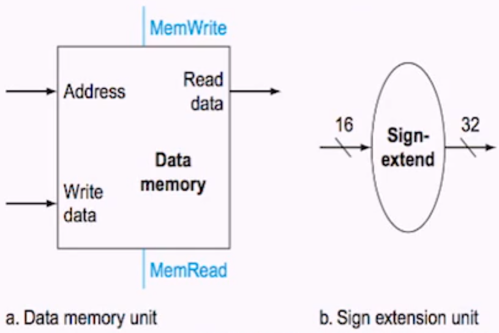

### Branch Instructions
1. Read register operands
2. Compare operands
   - Use ALU, subtract, and check zero output
3. Calculate target address
   - Sign-extend displacement
   - Shift left two places (word displacement)
   - Add to PC +4
     - Already caclulated by instruction fetch

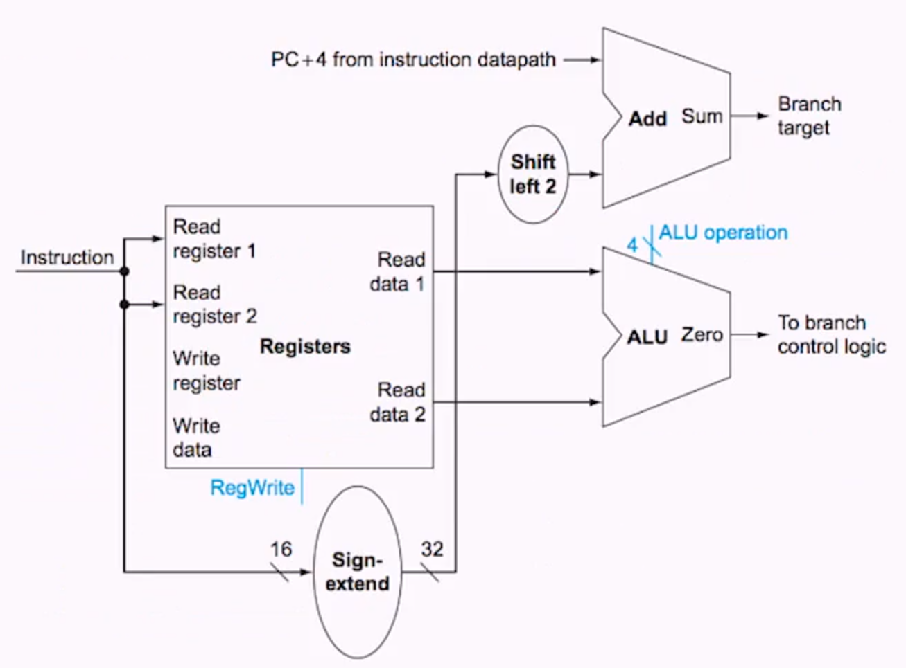

### Composing the Elements
- First-cut datapath does an instruction in one clock cycle
  - Each datapath element can do only one function at a time
  - Hence, we need separate instruction and memories
- use multiplexers where alternate data sources are used for different instructions

### R-Type/Load/Store Datapath

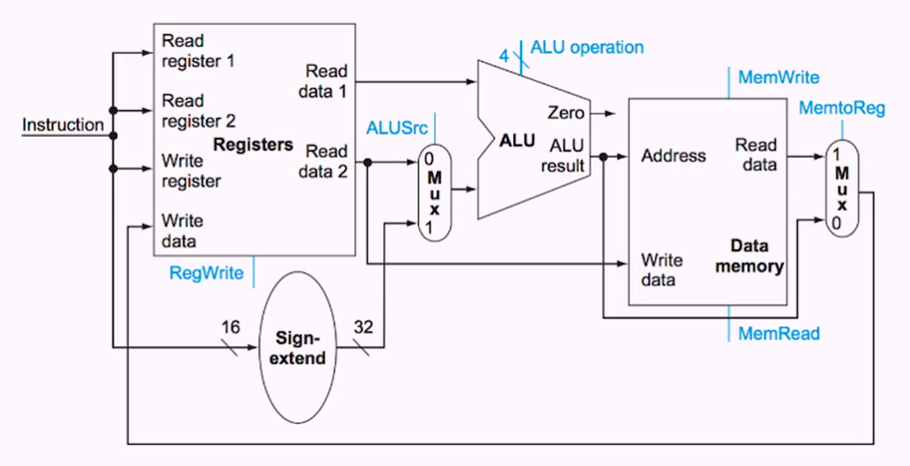

### Full Datapath (Single-Cycle Datapath)
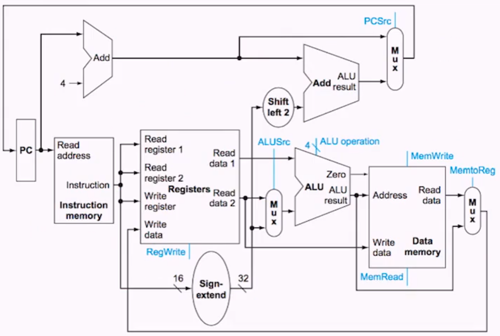

#### Question
> What is the branch target address for the following instruction

```
# PC = 4012
bne $t1, $t2, 11
```
...
```
PC + 4 = 4016
11 in dec, extended by 32 bits = 0000 1011 in bi

shift left by 2
0010 1100 = 44

PC + 32 extenstion + shift left 4
4012 + 44 + 4

```

## 5.5 ALU Control
([top](#week-5-the-processor))

- Depending on the instruction class, ALU performs one of five functions (not NOR)

|ALU Control LInes|Functions|
|:-:|:-:|
|0000|AND|
|0001|OR|
|0010|add|
|0110|subtract|
|0111|set on less than|
|1100|NOR|


ALU Actions for
- load/store instructions: **add**
  - add offset to base memory address
- compute memory address
- branch instructions: **subtract**
  - if `$t0 - $t1 == 0`, `t0 == $t1`
- R-type: (**AND**, **OR**, **subtract**, **add**, or **set on less than**) depends on 6-bit funct field

### ALU Conrol design

|Instruction Code|ALUOp|Instruction Operation| Funct Field|Desired ALU Action|ALU control input|
|:--|:--:|:--|:--:|:--|:--:|
|LW|00|load word|XXXXXX|add|0010|
|SW|00|store word|XXXXXX|add|0010|
|Branch equal|01|branch equal|XXXXXX|subtract|0110|
|R-type|10|add|100000|add|0100|
|R-type|10|subtract|100010|subtract|0110|
|R-type|10|AND|100100|AND|0000|
|R-type|10|OR|100101|OR|0001|
|R-type|10|set on less than|101010|set on less than|0111|

### 4-bit Control (Operation)


|ALU Op1|ALU Op2|F5|F4|F3|F2|F1|F0|Operation|
|:--:|:--:|:--:|:--:|:--:|:--:|:--:|:--:|:--:|
|0|0|x|x|x|x|x|x|0010|
|x|1|x|x|x|x|x|x|0110|
|1|x|x|x|0|0|0|0|0010|
|1|x|x|x|0|0|1|0|0110|
|1|x|x|x|0|1|0|0|0000|
|1|x|x|x|0|1|0|1|0001|
|1|x|x|x|1|0|1|0|0111|

### Formats of Three Instruction Classes
1. R-type instruction

|field|0|rs|rt|rd|shamt|funct|
|--|--|--|--|--|--|--|
|bits|31:26|25:21|20:16|15:11|10:6|5:0|

2. Load or store instruction
   - (only instuction to alter RAM)

|field|35 or 43|rs|rt|address|
|--|--|--|--|--|--|--|
|bits|31:26|25:21|20:16|15:0|

3. Branch instruction

|field|4|rs|rt|address|
|--|--|--|--|--|--|--|
|bits|31:26|25:21|20:16|15:0|


### Seven Control Signals

|Signal Name|Effect when deasserted (0)|Effect when asserted (1)|
|:-|:-|:-|
|RegDst|The register destination number for the write register comes from the rt field (bits 20:16)| The register desitination number for the write register comes from the rd field (bits 15:11)|
|RegWrite|None.|The Register on the Write register input is written with the value on the Write data input.|
|ALUSrc|The second ALU operand comes from the second register file output (Read data 2)|The second ALU operand is the sign-extended,lower 16 bits of the instruction|
|PCSrc|The PC is replaced by the output of the adder that computes the value of PC +4.|The PC is replaced by the output of the adder that computes the branch target|
|MemRead|None|Data memory contents designated by the address input are put on the Read data output|
|MemWrite|None|Data memeory conents designated by the address input are replaced by the value on the Write data input|
|MemtoReg|The value fed to the register Write data input comes from the ALU.|The Value fed to the register Write data input comes from the data memory|


### Datapath with Control Unit
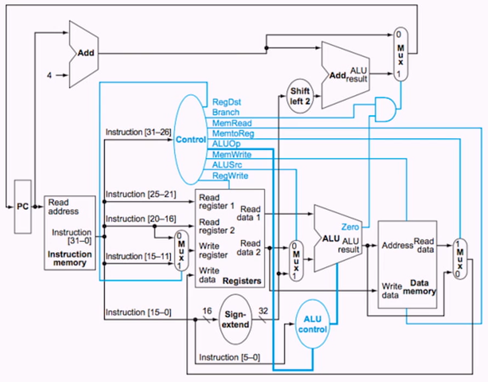

### Setting of Control Lines

|Instruction|RegDst|ALUSrc|Memto-Reg|Reg-Write|Mem-Read|Mem-Write|Branch|ALUOp1|ALUOp0|
|:-:|:-:|:-:|:-:|:-:|:-:|:-:|:-:|:-:|:-:|
|R-format|1|0|0|1|0|0|0|1|0|
|lw|0|1|1|1|1|0|0|0|0|
|sw|x|1|x|0|0|1|0|0|0
|beq|x|0|x|0|0|0|1|0|1

> Completely determined by the opcode files of the ins

### R-Type Datapath

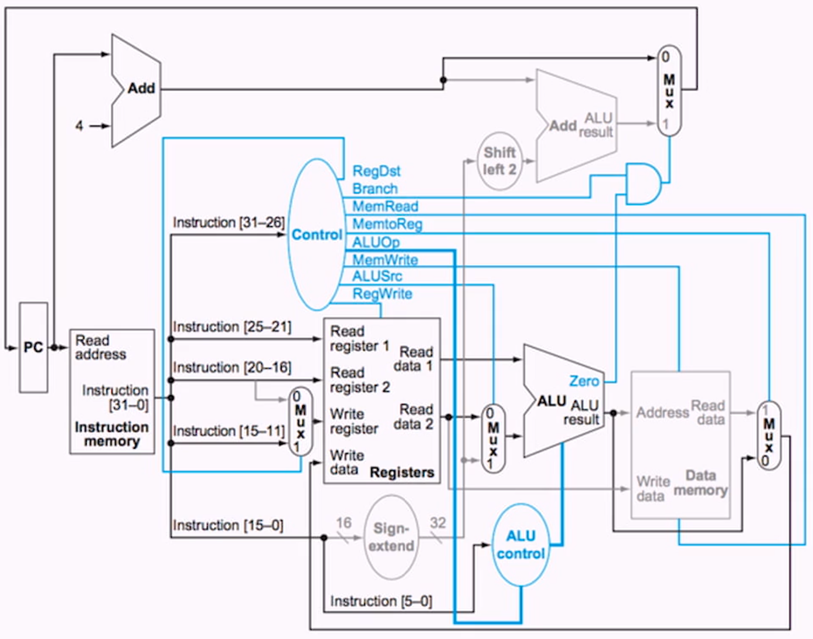

### Datapath with LoadOp

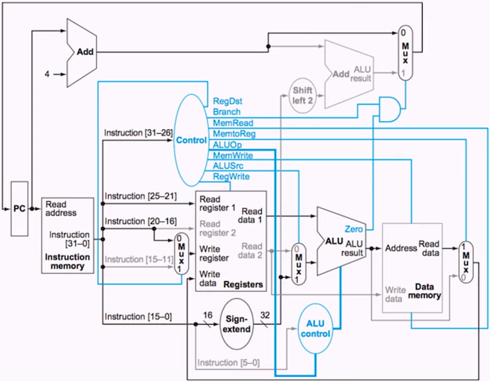

### Datapath Branch on Equal

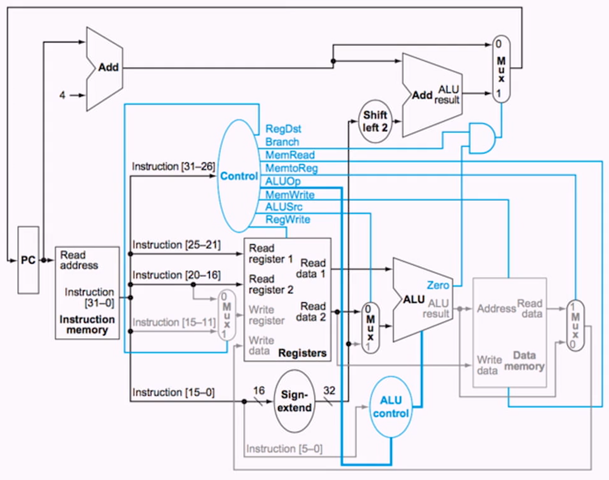

### Implementing Jumps
- Jump uses word address
- Update PC with concatenation of 
  - Upper 4 bits of the current PC + 4 (Bit_31:28)
  - 26-bit jump address (Bit_27:2)
  - 00 (Bit_1:0)
- Need an extra control signal decoded from opcode

|Field|000010|address|
|-|-|-|
|bits|31:26|25:0|

### Datapath Wtih Jumps

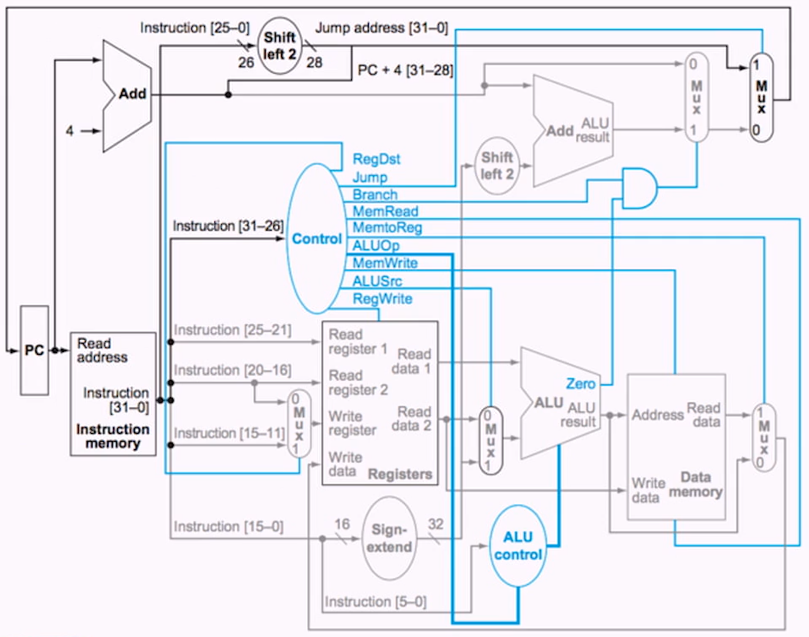