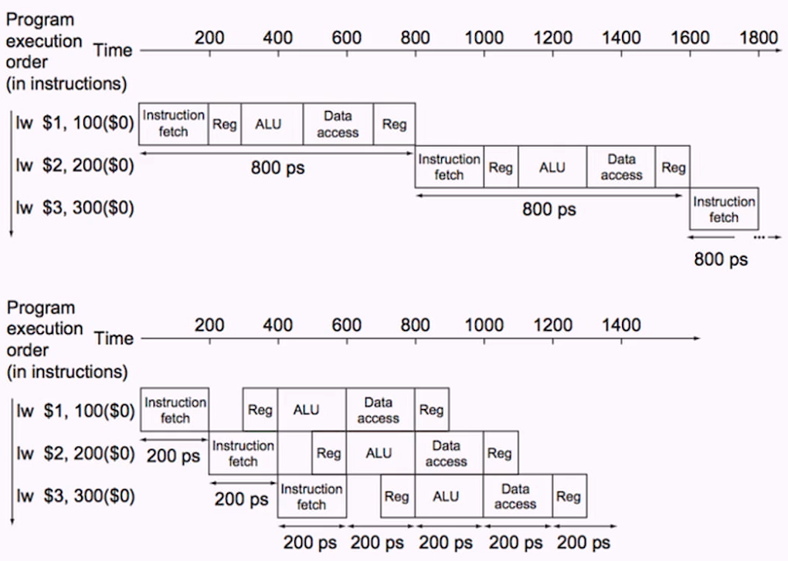
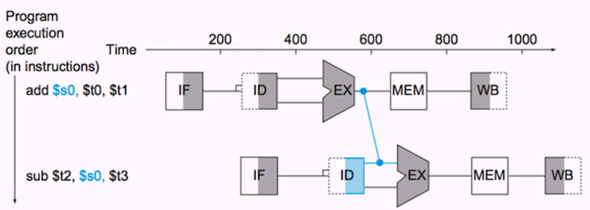
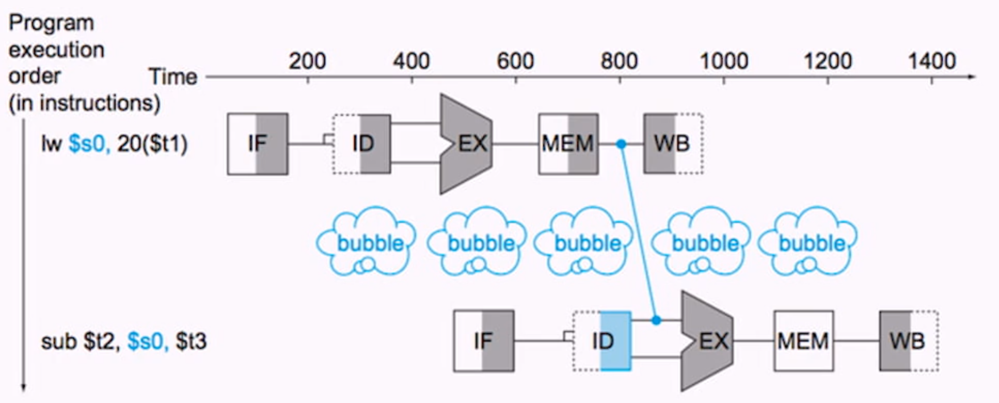

# Week 5 The Processor
- [Home](/README.md#async-table-of-contents)
- [5.1 Readings](#51-readings)
- [5.2 The Processor](#52-the-processor)
- [5.3 Logical Design](#53-logical-design)
- [5.4 Building a Datapath](#54-building-a-datapath)
- [5.5 ALU Control](#55-alu-control)
- [5.6 Pipelines](#56-Pipelines)
- [5.7 Pipeline Hazards](#57-Pipeline-Hazards)

## Questions
- Why do we shift left by 2 on the branch instruction? Not clear.
- In a datapath, where do we start? Instruction memory?
- Why move and not add `$zero`
- What data structures are caches? Queues? Heaps?
- Is it possible to write a procedure that takes care of our stack management for us?
## 5.1 Readings
([top](#week-5-the-processor))

*Patterson and Hennesy*
[Chapter 4 | *The Processor*](/readings/README.md#Chapter-4--the-processor)

## 5.2 The Processor
([top](#week-5-the-processor))

### MIPS Subset
- Hardware implementation for a subset of MIPS
  1. Memory references: Load/Store
  2. Arithmetic/Logical: `add`, `sub`, `AND`, `OR`, `slt`
  3. Branching: `beq`, `jump`
- Not all arithmetic instructions (no multiple divide, shift)
- No floating point math

### Instruction Execution Step
1. PC (program counter) &rarr; instruction memory, fetch instruction
   - PC holds the address of the instruction
2. Register numbers &rarr; register file, read registers
3. Depending on instruction class
   - use [ALU](/vocab/README.md/#Arithmetic-Logic-Unit) to calculate
     1. Arithmetic result
     2. Memory address for load/store
     3. Branch target address
4. Access data memory for load/store
5. PC &larr; target address or PC + 4
   - update pc

### MIPS Data Flow


### With Control


## 5.3 Logical Design
([top](#week-5-the-processor))

### Logical Elements
- **Combinational Elements** Output depends only upon their current inputs
  - Examples: ALU, Adder, Mutliplexer
- **State (sequential) elements** Has an internal state that impacts its output
  - Examples: Instruction and data memory, registers
  - Has two inputs:
    - Data: value to be written
    - Clock: determines when data are written

### Clocking Methodology
- **Clocking methodology** Defines when read and writes can happen
  - If a value is read and written at the same time, result could be some mix of new and old (or either).
  - Makes hardware predictable
- **Edge-triggered clocking** Sequential elements are updated only on a clock edge (transition from low to high or vice versa)

### Sequential Elements
- Register: stores data in a circuit
  - uses a clock signal to determine when to update the stored value.
  - Edge-triggered: update when clock changes from 0 to 1


- Register with write control
  - Only updates on clock edge when write control input is 1
  - Used when stored value is required late


### Clocking Methodology
- Combinational logic transforms data during clock cycles
  - between clock edges
  - input from state elements, output to state element
  - longest delay determine clock period


## 5.4 Building a Datapath
([top](#week-5-the-processor))

- Datapath
  - elements that process data and addresses in the CPU
    - Registers, ALUs, muxs, memories
  - how data moves around within the CPU

### Instruction Fetch

(common for all instructions)


### R-Format Instructions
- read two register operands
- perform artihmetic/logical operation
- write register result


- ALU zero output
  - 1 if ALU is zero
  - 0 if ALU is non-zero

### Load/Store Instructions
1. Read register operands
2. Calculate address using 16-bit offset
   - use ALU, but sign-extend offset
3. Load: reed memory and update register
4. Store: write register value to memory


### Branch Instructions
1. Read register operands
2. Compare operands
   - Use ALU, subtract, and check zero output
3. Calculate target address
   - Sign-extend displacement
   - Shift left two places (word displacement)
   - Add to PC +4
     - Already caclulated by instruction fetch


### Composing the Elements
- First-cut datapath does an instruction in one clock cycle
  - Each datapath element can do only one function at a time
  - Hence, we need separate instruction and memories
- use multiplexers where alternate data sources are used for different instructions

### R-Type/Load/Store Datapath


### Full Datapath (Single-Cycle Datapath)


#### Question
> What is the branch target address for the following instruction

```
# PC = 4012
bne $t1, $t2, 11
```
...
```
PC + 4 = 4016
11 in dec, extended by 32 bits = 0000 1011 in bi

shift left by 2
0010 1100 = 44

PC + 32 extenstion + shift left 4
4012 + 44 + 4

```

## 5.5 ALU Control
([top](#week-5-the-processor))

- Depending on the instruction class, ALU performs one of five functions (not NOR)

|ALU Control LInes|Functions|
|:-:|:-:|
|0000|AND|
|0001|OR|
|0010|add|
|0110|subtract|
|0111|set on less than|
|1100|NOR|


ALU Actions for
- load/store instructions: **add**
  - add offset to base memory address
- compute memory address
- branch instructions: **subtract**
  - if `$t0 - $t1 == 0`, `t0 == $t1`
- R-type: (**AND**, **OR**, **subtract**, **add**, or **set on less than**) depends on 6-bit funct field

### ALU Conrol design

|Instruction Code|ALUOp|Instruction Operation| Funct Field|Desired ALU Action|ALU control input|
|:--|:--:|:--|:--:|:--|:--:|
|LW|00|load word|XXXXXX|add|0010|
|SW|00|store word|XXXXXX|add|0010|
|Branch equal|01|branch equal|XXXXXX|subtract|0110|
|R-type|10|add|100000|add|0100|
|R-type|10|subtract|100010|subtract|0110|
|R-type|10|AND|100100|AND|0000|
|R-type|10|OR|100101|OR|0001|
|R-type|10|set on less than|101010|set on less than|0111|

### 4-bit Control (Operation)


|ALU Op1|ALU Op2|F5|F4|F3|F2|F1|F0|Operation|
|:--:|:--:|:--:|:--:|:--:|:--:|:--:|:--:|:--:|
|0|0|x|x|x|x|x|x|0010|
|x|1|x|x|x|x|x|x|0110|
|1|x|x|x|0|0|0|0|0010|
|1|x|x|x|0|0|1|0|0110|
|1|x|x|x|0|1|0|0|0000|
|1|x|x|x|0|1|0|1|0001|
|1|x|x|x|1|0|1|0|0111|

### Formats of Three Instruction Classes
1. R-type instruction

|field|0|rs|rt|rd|shamt|funct|
|--|--|--|--|--|--|--|
|bits|31:26|25:21|20:16|15:11|10:6|5:0|

2. Load or store instruction
   - (only instuction to alter RAM)

|field|35 or 43|rs|rt|address|
|--|--|--|--|--|
|bits|31:26|25:21|20:16|15:0|

3. Branch instruction

|field|4|rs|rt|address|
|--|--|--|--|--|
|bits|31:26|25:21|20:16|15:0|

### Seven Control Signals

|Signal Name|Effect when deasserted (0)|Effect when asserted (1)|
|:-|:-|:-|
|RegDst|The register destination number for the write register comes from the rt field (bits 20:16)| The register desitination number for the write register comes from the rd field (bits 15:11)|
|RegWrite|None.|The Register on the Write register input is written with the value on the Write data input.|
|ALUSrc|The second ALU operand comes from the second register file output (Read data 2)|The second ALU operand is the sign-extended,lower 16 bits of the instruction|
|PCSrc|The PC is replaced by the output of the adder that computes the value of PC +4.|The PC is replaced by the output of the adder that computes the branch target|
|MemRead|None|Data memory contents designated by the address input are put on the Read data output|
|MemWrite|None|Data memeory conents designated by the address input are replaced by the value on the Write data input|
|MemtoReg|The value fed to the register Write data input comes from the ALU.|The Value fed to the register Write data input comes from the data memory|


### Datapath with Control Unit


### Setting of Control Lines

|Instruction|RegDst|ALUSrc|Memto-Reg|Reg-Write|Mem-Read|Mem-Write|Branch|ALUOp1|ALUOp0|
|:-:|:-:|:-:|:-:|:-:|:-:|:-:|:-:|:-:|:-:|
|R-format|1|0|0|1|0|0|0|1|0|
|lw|0|1|1|1|1|0|0|0|0|
|sw|x|1|x|0|0|1|0|0|0
|beq|x|0|x|0|0|0|1|0|1

> Completely determined by the opcode files of the ins

### R-Type Datapath


### Datapath with LoadOp


### Datapath Branch on Equal


### Implementing Jumps
- Jump uses word address
- Update PC with concatenation of 
  - Upper 4 bits of the current PC + 4 (Bit_31:28)
  - 26-bit jump address (Bit_27:2)
  - 00 (Bit_1:0)
- Need an extra control signal decoded from opcode

|Field|000010|address|
|-|-|-|
|bits|31:26|25:0|

### Datapath Wtih Jumps


## 5.6 Pipelines
([top](#week-5-the-processor))

### Why a single-cycle implemetation is not used today
- Clock cycle must have the same length for every instruction
- Longest delay determines clock period
  - critical path: load instruction
  - instruction memory &rarr; ALU &rarr; data memory &rarr; register file
- Not feasiblle to vary period for different instructions
- violates design principle
  - making the common case fast
- we wil improve performance pipelining

### Pipelining Analogy
- Pipelined laundry: overlapping execution
  - parallellism improves performance

### MIPS Pipeline
Five stages, one step per stage

1. IF: instruction fetch from memory
2. ID: instruction decode and register read
3. EX: execute operation or calculate address
4. MEM: access memory operand
5. WB: write result back to register

### Pipeline Perfomance
- Assume time for stages is
  - 100ps for register read or rwrite
  - 200ps for other stages
- comare pipeline datapath with single-cycle datapath

|Instruction Class|Instruction Fetch|Instruction Read|ALU Operation|Data Access|Register write| Total Time|
|:--:|:--:|:--:|:--:|:--:|:--:|:--:|
|Load Word (lw)|200ps|100ps|200ps|200ps|100ps|800ps|
|Store Word (sw)|200ps|100ps|200ps|200ps||700ps|
|R-format(add, sub, AND, OR, slt)|200ps|100ps|200ps||100ps|600ps|
|Branch (beq)|200ps|100ps|200ps| | |500ps|



### Pipeline Speedup
- If all stages are balanced
  - I.e. all take the same time
<code>Time between instructions<sub>pipelined</sub> = Time between instruction<sub>nonpipelined</sub> / Number of stages</code>
- If not balanced, speedup is less
- Speedup due to increased throughput
- Latency (time for each instruction) does not decrease

### Pipelineing and ISA Design
- MIPS ISA designed for pipelining
- All instructions are 32-bits
  - Easier to fetch and decode in one cycle
  - C.f. x86: 1- to 17-byte instructions
- Few and regular instruction formats
  - Can decode and read registers in one step
- Load/store addressing
  - Can calculate address in third stage, access memory in  fourth stage
- Alignment of memory operands
  - Memory access takes only one cycle

## 5.7 Pipeline Hazards
([top](#week-5-the-processor))

### Hazards
- Situations that prevent starting the next instruction in the next cycle
- **Structure hazard**
  - A required resource is busy
- **Data hazard**
  - Need to wait for previous instruction to complete its data read/write
- **Control hazard**
  - Deciding on control action depends on previous instruction.


### Structure Hazard
- Conflict for use of resource
- In MIPS pipeline whith a single memory
  - Load/store requires data access
  - Instruction fetch would have to stall for that cycle
    - would cuase a pipeline *bubble*
- Hence, pipelined datapaths require separate instruction/data memories
  - Or separate instruction/data cache

### Data Hazards
- an instruction depends on completion of data access by a previous instruction

```
add $s0, $t0, $t1
sub $t2, $s0, $t3
```
- want to parallelize
- output from ALU has to go back to register, wait until $s0 is written
```
lw $s0, 20($t1)
sub $t2, $s0, $t3
```

### Forwarding (Bypassing)

- Use result when it is computerd
  - don't wait for it to be stored in a register
  - requres extra connections in the datapath
    - more complex hardware to pass data forward




### Load: Use Data Hazard
- can't always avoid stalls by forwarding
  - if value not computed when needed
  - Can't forward backward in time!



### Code Scheduling to Avoid Stall
- **Reorder** code to avoid use of load result in the next instruction
- C code for
```C
A = B + C;
C = B + F;
```

```

lw  $t1, 0($t0)      lw  $t1, 0($t0)
lw  $t2, 4($t0)      lw  $t2, 4($t0)
add $t3, $t1, $t2    lw  $t4, 8($t0)
                     ______________
sw  $t3, 12($t0)     add $t3, $t1, $t2
lw  $t4, 8($t0)      sw  $t3, 12($t0)
_______________
add $t5, $t1, $t4    add $t5, $t1, $t4
sq  $t5, 16($t0)     sw  $t5, 16($t0)

     13 cycles          11 cycles
```

### Control Hazards
- Branch determines flow of control
  - Fetching next instruction depends on branch outcome
  - Pipeline can't always fetch correct instruction
    - Still working on ID stage of branch
- In MIPS pipeline
  - Need to compare registers and compute target early in pipeline
  - Add hardward to do it in ID stage 

### Stall on Branch
- Wait until branch outcome determined before fetching next instruction

### Branch Prediction
- Longer pipelines can't readily determine branch outcome early
  - Stall penalty becomes unacceptable
- Predict outcome of branch
  - only stall if prediction is wrong
- In MIPS pipeline
  - Can predict branches not taken
  - Fetch instruction after branch, with no delay

### More Realistice Branch Prediction
- Static branch prediction
  - Based on typical branch behavior
  - Example: loop and if-statement branches
    - predict backward branches taken
    - predict forward branches not taken
- Dynamic branch prediction
  - Hardware measures actual branch behavior
    - eg record recent history of each branch
  - Assume future behavior will continue the trend
    - when wrong, stall while refetching, and update history
