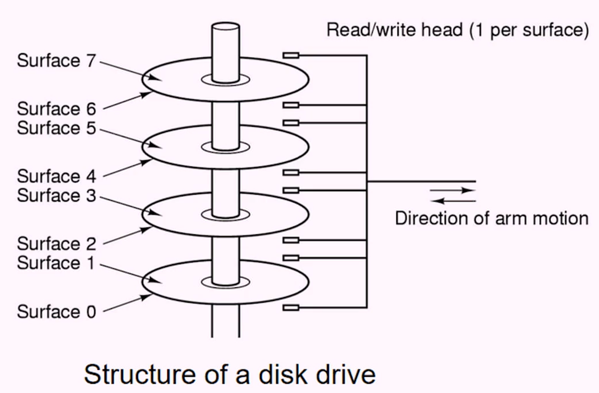
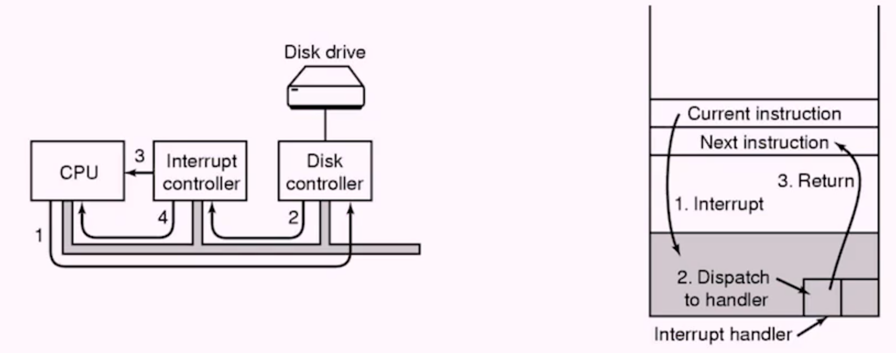

# Week 6 Operating System Introduction
- [Home](/README.md#async-table-of-contents)
- [6.1 Readings](#61-readings)
- [6.2 Operating System Introduction](#62-Why-do-we-need-an-operating-system)
- [6.3 History of the Operating System](#63-history-of-the-operating-system)
- [6.4 Computer Organization](#64-computer-organization)
- [6.5 Boot Process](#65-boot-process)
- [6.6 Processes](#66-processes)
- [6.7 Address Space](#67-address-space)
- [6.8 System Calls and Interupts](#68-system-calls-and-interupts)

## Questions
- What is Turing complete?
- What is a Von Neumann Machine?
- How do we know the initial PC of the OS?

## 6.1 Readings
([top](#week-6-operating-system-introduction))

*Oh*
[Chapter 1 | *Operating Systems Introduction*](/readings/README.md#oh-Chapter-1--operating-systems-introduction)

## 6.2 Why do we need an operating system?
([top](#week-6-operating-system-introduction))

### Why do we need an OS?

Two core purposes:
1. **Abstraction**
   - Hides low-level details of hardware implementation from users and even software developer.
> What implications would it have for software developers if there were no abstraction?

### No Abstraction?
- Programmers would need to know about the exact specifications of computer hardware (drivers)
- Programmers would need to know where in memory (RAM) the proram would be running.
- Programmers would likely need to configure hardware devices (Ethernet card is initialized)
- What about hardware fault management?

### Why do we need an OS?
2. **Resource Management**
   - Correctness in sharing of hardware resources
   - Fair allocation of resources (multiple programs running?)
> Implications of no resource management?

### No Resource Management>
- Multiple running programs reading from disk - would these step over each other?
- Data protection? Could programs read/write each other's memory in RAM? On files on disk?
- Single program hogs some resource (Disk, ethernet, etc)
> Under what circumstances might we not need a lot of abstraction and resource management?

Firmware vs Operating System
- **Firmware**
  - Typically runs on simple devices that execute a single function (or very simple function)
  - Saved in nonvolatile memory
  - BUild in to hardware, effectively part of the hardward, but can be upgraded/corrupted/infected

- **Operating System**
  - Runs multiple, highly varied functions (programs)
  - Typically works in conjunction with firmware (will see this later)

### Where can we find an OS?
- Computers
- Cell phones,
- iPod
- iPad
- Copiers
- Fax
- Cars
- Digital cameras
- Electronc games
- xbox

## 6.3 History of the Operating System
([top](#week-6-operating-system-introduction))

### Timeline
- Charles Babbage's Difference Engine 1823-1842
  - mechanical calculator
- First generation 1945-1955
  - vacuum tubes, plug boards
- Second generation 1955-1965
  - Transistors, batch systems. card readers, etc
- Third generation 1965-1980
  - ICs and multiprogramming
- Fourth generation 1980-present
  - Personal computers
- *Fifth generation* 1999-present
  - The internet or connected

### Difference Engine
- Mechanical in nature, used to calculate polynomial functions (logarithmic/trigonometric tables)
- Ada Lovelance wrote the first algorithm to compute the Bernoulli squence
- Original project was not completed due to cost
- Finally build in early '90s

### First Generation
- ENIAC was one of the Turing-complete binary computers
- Developed at the University of Pennsylvania
- Commissioned in 1946
- Primarily design to compute artillery firing tables
- Was "programmed" via switches and cables taking days (after the program was worked out on paper)

### Second Generation
- Punch cards were stored on a deck of cards
- Each card was more or less single instruction

#### Punch Cards
- Punch cards ran in batches
- Multiple programs grouped together
- Transferred to tape
- Ran multiple programs sequentially

### Third Generation
- Multiprogramming: When one proram was blocked on I/O, run a different one
- Led to time-sharing, where developers had terminals at their desks
- Microprocessor was born in 1971 at Intel
- MULTICS (MULTiplexed Information and Computing Service) was developed. But was too big and complex
- UNICS (UNiplexed Information and Computing Service) was a stripped-down versio. UNICS rewritten in C became UNIX.

### Fourth Generation
- Personal computing started
- Large-scale integrated circuits introduced
- Computers could now fit on your desk and used not just by technocrats.
- Commercial success begins: MS-DOS, Apple Macintosh

## 6.4 Computer Organization
([top](#week-6-operating-system-introduction))

> from the view of the operating system

### Von Neumann Machines
- Computers today are still Von Neumann machines
  - Store programs in memory (along with data)
  - fetch instruction
  - decode instruction
  - execute instruction
- All Computers have the following components
  - CPU
  - Memory
  - Input/Output

### Fetch, Decode, Execute
- **Program Counter**: Keeps track of address of current instruction to execute.
- **Status Register**: Indicates current state of the processory.
- **Instruction Register**: Hold instruction just decoded.
- **Algorithmic Logic Unit**: Performs algorithmic and logical computations.

> [Computer Memory Hierarchy](https://en.wikipedia.org/wiki/Memory_hierarchy)

### Question
> Why does having a cache help at all? What principles can you recall about the execution of programs?

### Locality of Reference
- **Spatial locality** Memory locations close to the last-used locations are likely to be used soon.
- **Temporal locality** Memory locations used recently are likely to be used again soon.

### Hard Disks

> moving parts are slower than electrons, less durable

## 6.5 Boot Process
([top](#week-6-operating-system-introduction))

### Booting Process
- Power supply strats and sends a reset signal to CPU
- The CO Uexecutes the JUMP instruction to jump to the bootstrap program (BIOS)
  - **BIOS** Basic Input Output Service
- BIOS checks all the hardware and configuration
- BIOS then looks for an OS in hard dist (or any other media)
- OS is now loaded in the main memory.
- Then PC is set to the first instruction of the OS
- OS runs and initializes other stuff, starting system processes, and so on

## 6.6 Processes
([top](#week-6-operating-system-introduction))

### A Program in Execution
- A **program** is typically defined as an executable file.
- A **process** is a program *in* execution.
- The same program may be running multiple times on the same machine.

#### Question
- What state wshould we keep track of for a running program?
> We want to know where the PC is for that program.

### Process Control Block
- **PCP**: operating system data structure for maintaining a process.
- **Process state**: running, wating, and so on
- **Program counter**: next instruction to execute for the process
- **CPU registers**: a copy of the registers for this process
- **Address space**: management information (stack pointer, etc)

#### Question
- Why might the OS need a copy of the register?
> Registers contain the state of a process. I bet if you can refill all of the registers and stack, then you can pick up where you left off if you know the PC.

### Multiprogramming
- Multiprogramming: concept of running multiple processes at the same time. (Sometimes referred to as multitasking)
- We do not assume mutiple CPIs (multiple CPUs called parallel execution)
- Only a single process is running at any individual time.
- OS scheduler switches between processes so quickly so as to give illusion of parallelization

### Context Switching
- A **context switch** occurs when the operating system swaps the current running process for another
- operating system will run a subroutine to switch the current process *A* to the next process to run, *B*

1. Save all of the CPU registers into the PCB for A. Mark process *A* as **ready**
2. Load all of the registers into the CPU from process *B*'s PCB. Mark process *B* as **running**

#### Question
- What do you think the last register loaded into the CPU for the next process is?
> It would either be the stack pointer `$sp` or the PC.

### Operating System Users

1. OS users
2. Sowftware developers
3. Operating system developers

## 6.7 Address Space

([top](#week-6-operating-system-introduction))

### Process Memory

Each process has its own address space consisting of:
- **text segment** the executable program code
- **static segment** static variables
  - `static char* username = "dshannon";`
  - BSS: uninitialized static variables
- **dynamic data segment** (heap memory)
  - `int* array = malloc(sizeof(int) * 100);`
  - `int* array = new int[100];`
- **stack segment**
  - local variables
  - *stack frames* are generated for function calls

### Process Address Space

|address space|address (hex)|
|:-:|:-:|
|stack|FFFF|
|###########|&darr;|
|###########|&darr;|
|###########|&uarr;|
|data|&uarr;|
|text|0000|

#### Question
- How can multiple processes have their address at 0?
> I think there's something called the virtual memory space. My guess is that some data structure keeps track of process and their true start and end addresses. Then those addresses are simply normalized to a zero starting address.

### Virtual Address vs Physical Address
- Compilers use virtual address when generating executable programs.
  - **how could compiler know the physical address?!**
- Generally, the process memory can go anywhere in the physical RAM.
- Operating system is responsible for mapping between virtual and physical address spaces.

## 6.8 System Calls and Interupts
([top](#week-6-operating-system-introduction))

#### Question
- If the CPU on ever does fetch, decode, and execute, how does the code for doing the context switch logic get run?

> Have a stack of process counters. 

### Interupts
- Since we can't inject new code, hardware has to help!
- An **interrupt** is a signal to the processor that something needs attention.
- An interrupt can be triggered via software OR hardware (but CPU must support)
- **HW interrupt** Typically via a device: keyboard, disk, Ethernet, etc. These are asynchronous and **can come at anytime**.
- **SW interrupt** Triggered via a **trap** which can be triggered by a **fault** (divide-by-zero) or a **system call**.

### System Call
- System calls are exposed for software developers to invoke code in the operating system.
- **Access devices**:
  - Read from file
  - Get mouse position
  - Create directory
  - Open a webpage
- **Impact OS management**:
  - Open an applicatoin (creates a new process)
  - Allocate space for new variable in heap.

### Kernel vs User Mode
- Once the trap has occured, the operating system switchs to privileged mode (special CPU flag/register to enable kernel mode).
- When kernel mode = true, code run is allowed to control the devices and execute in privileged mode.

### Interrupt Handling

- Program A is running
0. Interrupt signal is received
1. Hardware stacks program counter and so on.
2. Hardware loads new program counter from interrupt vector.
3. Assembly language procedure saves registers.
4. Assembly language procedure sets up a new stack.
5. C interrupt service runs (typically reads and buffers input)
6. Scheduler decides which process is to run next.
7. C procedure returns to assembly code.
8. Assembly language procedure starts up new/current process.

### Interrupt Vector (Table)
- Associates interrupt requests with interrupt handlers (code).

