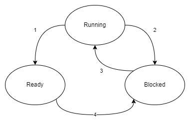
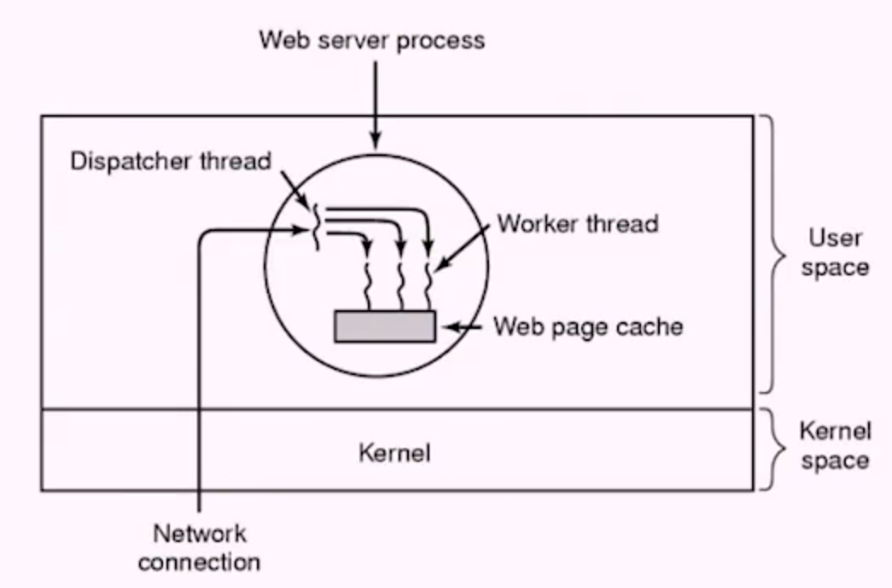

# Week 7 Processes and Threads

- [Home](/README.md#async-table-of-contents)
- [7.1 Readings](#71-readings)
- [7.2 Processes Creation](#72-processes-creation)
- [7.3 Process Life Cycle](#73-process-lifecycle)
- [7.4 Threads](#74-threads)
- [7.5 Java Threads](#75-java-threads)
- [7.6 OS Scheduler](#76-os-scheduler)
- [7.7 Round Robin Scheduler](#77-round-robin-scheduler)

## Questions
- Why would there be a kernel thread vs user thread?
- In the web server example, is that a kernel thread or a user thread?
  - Kernel?
- Is OS indepenedent of architecture?   

## 7.1 Readings
([top](#week-7-processes-and-threads))

*Oh*
[Chapter 2 | *Processes and Threads*](/readings/README.md#oh-Chapter-2--processes-and-threads)

## 7.2 Processes Creation
([top](#week-7-processes-and-threads))

### Multiprogramming
- things run more sequentially than in parallel.
- One program counter
  - each process has its own program counter

### Creating a New Process in UNIX
- **fork**: Unix **system call** to create a copy of the invoking process
- The calling process is called the **parent**; the newly created process is called the **child**
- For is standardized by **POSIX** (Portable Operating System Interface). Implemented by most UNIX (including Mac OS as of Leopard) and is closely adhered to in Linux.

#### Question

> Who and where is fork implemented?

- The operating system is my guess.

### Fork Details
- Everything gets copied, PCB is an exact copy, address space, registers, file descriptors, and so on (process ID would be different)
- The child process starts off, and the first thing it does is return from the very system call its parent made!
- How can the child's and parent's execution path separate?
- **Hint**: `interface: int fork()`

### Fork Use Sekelton &#128128;

```C
#include <stdio.h>
#include <unistd.h>

int main (void){
    int val = 0;
    int proc_id;
    printf("Hello!\n");
    proc_id = fork();
    if (proc_id == 0){
        val++;
        printf("I am the child: val=%d\n", val);
    }
    else {
        val--;
        printf("I am th eparent; the child's ID is %d and val is %d\n", proc_id, val);
    }
    printf("Goodbye! Value of val = %d\n", val);
    return 0;
}
```

### Possible Fork Implementation
(pseudo code)
```
Algorithm Fork()
Input: none
Output:
  to parent process, child PID number;
  to child process, 0
if (canBeParent) {
    // executing process is a parent process
  check for available kernel resources;
  get free process table slot and a unique ID
  make child state being created
  copy meta-data of parent process to the child
  copy parent's address space (text, data, stack, etc)
    to the child's
  do ther initializations
  change child state to ready to run
  put the child to the ready-queue
  return (child ID);
} else {
  set this procress canBeParent = True;
  and other necessary initializations
  return (0);
}
end Algorithm Fork()
```

### Process Hierarchies
- Parent creats a child process; child processes can create its own processes
- Forms a hierarchy
  - UNIX calls this a "process group"
- Windows has no concept of process hierarchy
  - All processes are created equal

## 6.3 Process Life Cycle
([top](#week-7-processes-and-threads))

### Process States
- **Running**: Process is currently running in the CPU
- **Ready**: Process is ready to run (waiting for scheduler to choose it to run)
- **Blocked**: Process is waiting for some external event to happen (example process is waiting for a file read)

### Process State Diagram



> 1. Process blocks for input
> 2. Scheduler picks another process
>    - `yield syscall`
> 3. Scheduler picks this process
> 4. Input becomes available

### Process Termination
Conditions that terminate processes:
1. Normal exit (voluntary)
2. Error exit (voluntary)
3. Fatal error (involuntary)
4. Killed by another process (involuntary)
   1. Kill command
   2. A **daemon** process finds zombie processes
   3. Within a program

### Process System Calls
process management

|Call|Description|
|:-:|:-:|
|`pid = fork()`|create a child process identical to the parent|
|`pid = waitpid(pid, &statloc, options)`| wait for a child to terminate|
|`s = execve(name, argv, environp)`|replace a process' core image|
|`exit(status)`|terminate process execution and return status|

### Using Exec and Waitpid

``` C
#include <stdio.h>
#include <stdlib.h>
#include <unistd.h>
#include <sys/types.h>

main(){
  pid_t pid;
  int status;
  pid = fork();
  if (pid != 0) { // parent code
    waitpid(pid, &status, 0);
    printf("******* I am the parent!!!\n");
  }
  else {
    static char *argv[] = {"ls","-a", NULL};
    execvp("ls", argv);
  } // main
}
```
> an example of using `fork()`, `exe()`,` waitpid()`, and `exit()` system calls

## 7.4 Threads
([top](#week-7-processes-and-threads))

### Thread Motivations
- **Blocking system call** needs to wait on some I/O, such as disk read. Sometimes called **synchronous** call. Entire process is put into **blocked** state.
- **Non-blocking system call** (ie **asynchronous**) kicks off a request (typically to a device) but doesn't wait for completion. Polling, signals, callbacks, or threads would be needed to handle the result.

### Threads
- A **thread** (or thread-of-execution) is a component of a process that allows intra-process parallelization.
- A thread has stack and its own set of registers, but *shares the process address space* with other threads within the same process.

### Thread Example

- Web server processes take thousands of requests per second.



### Proces vs Thread

#### Per Process Items (shared accross threads)
- address space
- global variables
- open files
- child processes
- pending alarms
- signals and signal handlers
- accounting information

#### Per Thread Items
- program counter
- registers
- stack
- state


### User Threads vs Kernel Threads
Threads can be implemented in either the kernel or user space.

- **kernel threads**:
  - Kernel manages thread state
  - Scheduling can be **pre-emptive** (we can force out a thread).
  - Easy support for blocking system calls.
  - System calls required for scheduling, update, or creation.
- **user threads**:
  - Kernel is completely unaware of threading
  - User process/library manages thread state
  - Pre-emption is not possible; threads must leave on their own.
  - Generally require nonblocking system calls (in OS)
  - No system call for scheduling, update, or creation

> System calls are expensive. User threads are a little faster from the management perspective.

> Most threads will be kernel threads

### Treads in Java
- JVM is really a specification; native (kernel threads) may not exist on the host OS. In that case JVM uses user-space threads (called **green threads**)
- Two ways to implement:
  - Implement thread subclass
  - Write class that implements runnable interface

#### Question
- How can you write a java program to test if threads are natively supported in the OS?

> we can try to run two blocking processes at the same time

## 7.5 Java Threads
([top](#week-7-processes-and-threads))

```java
/*
 * JavaThreadExtender is a simple Java thread example.
*/
import java.util.ArrayList;
import java.util.List;

public class JavaThreadExtender extends Thread{
  private int number;
  public JavaThreadExtender(int i){
    super("MyThread:" + i);
    this.number = i;
  }
  public void run(){
    for (int i=0; i < number; i++) {
      // pritnln thread-safe?
      System.out.println(number + ":" + i);
    }
  }

  public static void main(String[] argv){
    List<Thread> threads = new ArrayList<Thread>();
    for (int i = 0; i<20; i++) {
      Thread t = new JavaTreadExtender(i);
      threads.add(t);
      // moving thread to ready state
      t.start();
    }
  }
}
```
> `JavaThreadExtender.java`

```java
import java.util.ArrayList;
import java.util.List;

public class JavaThreadRunnable implements Runnable {
  private int number;

  public JavaThreadRunnable(int i){
    this number = i;
  }

  public void run(){
    for (int i = 0; i < number; i++) {
      System.out.println(number + ":" + i);
    }
  }

  public static void main(String[] argv){
    List<Thread> threads = new ArrayList<Thread>();
    for (int i = 0; i < 20; i++){
      Thread t = new Thread(new JavaThreadrunnable(i));
      threads.add(t);
      t.start();
    }
  }
}
```
> `JavaThreadRunnable.java`

## 7.6 OS Scheduler
([top](#week-7-processes-and-threads))

### OS Sheduler
- Decision amde by OS designers: What is the schedulable entity? Process? Thread? Other?
- What type of system is the scheuler being designed for? Batch? Personal computing?

### Preemption
- **Preemption** happens when the OS scheduler forces a thread/process out of the CPU without its consent
- OS Needs to be able to do this
- Otherwise a process could *starve* all other process in the system.

- Another system call `yield` that simply puts the currently running process back on to the ready queue (i.e. out of the CPU)

### Ready Queue
- The scheduler (kernel) will keep a list of all of the jobs that are in state **ready**, called the **ready queue**
- when a job becomes unblocked it is moved into the **ready queue**. The logic of how to insert into the list is scheduler specific.
- When it is time to pick the next process/thread to run, the scheduler typically picks the front of the list

### Scheduler Performance?
- **Throughput**: The number of processes (jobs) completed in a specific time unit (eg five jobs/millisecond)
- **Turnaround time**: Time between the reqeust to run and the job's completion. Average, max, and min may all be important.
- **Wait time**: Time spent waiting to run. Average, max, and min may all be important
- **Starvation**: Can the policies of the scheduler lead to a process never getting to run?
- **Complexity overhead**: Complex software is hard to maintain and check for correctness. In general we'd like the simplest algorithm that acheives our goals.

### Batch Schedulers
In batch mode, typically a process is run that does not depend upon any user interaction. Example: MapReduce jobs at Google/Amazon/etc
- **FIFO** (first in first out)
  - The first process that requests to run is run until completion
- **Shortest job first**
  - Job with the shortes time will run to completion
- **Shortest remaining time**
  - Similar to SJF, but jobs can be interrupted if a shorter job arrives
- **Priority based**
  - Jobs are assigned a priority. Job with highest priority runs to completion.

#### Question
- What kind of problems would you anticipate with shortest job first compared to FCFS?
> With shortest job first, long jobs may never get to run. With FCFS, a long job could block what should be short jobs.

## 7.7 Round Robin Scheduler
([top](#week-7-processes-and-threads))

### Round Robin Scheduler
- RR scheduler is a pre-emptive scheduler
- Each job is given a fixed quanta of time to run in the CPU
- All jobs are treated equally (no priority classes)
- Straight forward and starvation free

#### Round Robin Example
- quanta = 10ms

|Process|Arrival Time (ms)|Run Time (ms)|
|:-|:-|:-|
|P0|0|22|
|P1|5|15|
|P2|13|8|

|Time (ms)|Current Process|Next Process|Ready Queue| Notes|
|:-|:-|:-|:-|:-|
|0|EMPTY|P0|P0,|P0 arrives|
|5|P0|N/A|P1,|P1 arrives|
|10|P0|P1|P0|Quanta expired|
|13|P1|N/A|P0,P2|P2 arrives|
|20|P1|P0|P2,P1|Quanta expired|
|30|P0|P2|P1,P0|Quanta expired|
|38|P2|P1|P0|P2 completes|
|43|P1|P0|Empty|P1 completes|
|45|P0|EMPTY|EMPTY|P0 completes|

> every 10ms execute a hardware interrupt

#### Question
- Other than quanta expiration, what are two other reasons the scheduler might have to choose a different job to run?
> Exception from divide by zero or overflow. And interrupt from a user appliction.