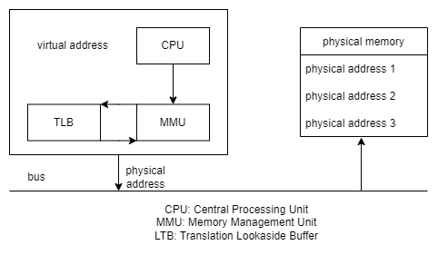

# Week 9 Memory Management

- [Home](/README.md#async-table-of-contents)
- [9.1 Readings](#91-readings)
- [9.2 Memory Management](#92-memory-management)
- [9.3 Contiguous Memory Allocation](#93-contiguous-memory-allocation)
- [9.4 Noncontiguous Memory Allocation](#94-noncontiguous-memory-allocation)
- [9.5 Page Table Alternatives](#95-page-table-alternatives)
- [9.6 Swapping](#96-swapping)
- [9.7 Page Replacement Algorithms](#97-page-replacement-algorithms)
- [9.8 Segmentation](#98-segmentation)

## Questions
- Similar to how every compuer has IO, processor, and memory, is there a standard set of operations for operating systems? We've been discussing operating systems, but what makes and OS an OS?

## 9.1 Readings
([top](#week-9-memory-management))

*Oh*
[Chapter 3 | *Memory Management*](/readings/README.md#oh-Chapter-3--Memory-management)

## 9.2 Memory Management
([top](#week-9-memory-management))

### Why Memory Management?
- Data protection (between user processes, between user process and operating system)
- Run programs larger than our physical RAM
- Translate virtual memory to physical memory

### Heirarchy
- **CPU registers** Typically have 32 registers, each typically 1 word (usually 4 bytes)
- **L1 cache** 10s of KB
- **L2 cache** a few megabytes
- **Main memory (RAM)** GB/TB (10s ns currently)
- **Hard disk** GB to PB (10 ms currently)

### Locality of Reference
- **Spatial locality** Addresses near recently referenced memory locations will be used soon.
Example:
1. Arrays (contiguous memory), iterating over each index.
2. Program execution is often linear.

- **Temoral locality** Addresses referenced recently are likely to be referenced again soon.
Example:
1. Saving a vlue into a variable (to be read later)
2. For loop `for(int i = 0; i < x; i++)`, `i` and `x` will be used again soon.

#### Question
- What impact to C style `goto` statements have on localitly of reference?


## 9.3 Contiguous Memory Allocation
([top](#week-9-memory-management))

### Process Address Space
- We can't assume process is loaded into RAM starting at address 0
- Compiler does assume program starts at 0 (were should it assume the prcess would go into memory?)
- **Physical address**: Where a process's address space is loaded in RAM
- **Virtual address**: The linear address space that begins at 0 that the executable assembly is based on

### MMU: Memory Management Unit
- We need to convert virtual address to physical address



### Physical Memory
- The simplest solution: assign every process a start (base) and end (limit) pointer into RAM.
- CPU will have special base/limit registers to translate
- The virtual address goes linearly into this portion

### Memory Translation
- To convert we merely add the offset to the virtual address
- and we ensure the program is not accessing memory outside of its partition

```c
int Translate(int virtualAddr){
    int result = virtualAddr + startAddr;
    if (result > endAddr) {
        raise exception;
    }
    return result;
}
```

### Question
- What problems does this create?

### Two Problems with this approach
- Process memory cannot be bigger than RAM. Recall that process address space includes heap, static data, stack, and instructions
- The RAM will slowly become fragmented into many small noncontiguous gaps as processes terminate

### how to fix?
- Periodic memory compaction?
  - Extremely time-consuming
  - All user process will be blocked
  - Potentially copying over large amounts of memory

## Finding Free RAM
- To track memory, the OS must keep track of all free RAM
- Can keep a linked-list of start, end pairs of free RAM
- Sorted by start address to merge consecutive holes
- How to choose which block?

### Choosing a Free Ram Block
- **First Fit** first free RAM block from beginning of list that fits new program (might be too large_.
- **Next Fit** start off searching where the last search ended. Move evenly using RAM, rather than focussing on lower addresses.
- **Best Fit** smallest free RAM block that fits new program; need to search entire list.
- **Worst Fit** largest free RAM block that fits new program; need to search entire list.

## 9.4 Noncontiguous Memory Allocation
([top](#week-9-memory-management))

### Process Larger Than RAM?
- With contiguous memory, a program's address space must fit into RAM
- Can we load only part of a process's address space into RAM

### Overlays
- Overlays are commonly used in video games (think game stages, boards, etc)
- The application programmer must manually divide the program into multiple parts
- Each overlay must individually fit into RAM
- Overlays can start their virtual address space at 0 (and use base/limit pairs)
- Notice in game consoles, typicaly amount of RAM is non configurable
- Just OS and one game playing at a time

### Paging
- Overlays can be of variable size
- programmer must split up program
- programmer should know how large RAM is
- can we do better?

- **paging** split procress address space into equal fixed-size chunks (pages)
  - automatically done by the operating system
  - programmer doesn't need to know RAM size

- Assume we have a process of 35 MB (&gt;2<sup>25</sup>) and page size of 8 KB (2<sup>13</sup>), we need 2<sup>26</sup>/2<sup>13</sup>=2<sup>13</sup> (more than 8,000 pages)
- RAM must also be divided into page frames. 16GB RAM with 8KB pages will have 2<sup>34</sup>/2<sup>13</sup>=2<sup>21</sup> (~2 million pages)
- a page from any progress can go in any page frame in RAM


### How to Translate?
- Each PCG (process control block) will have a page table
- Pages that are not in memory will be kept in a special area on the hard disk called (swap)
- MMU has pointer to the memory address of the page Table for currently running process

### Virtual Address
- a virtual address is composed of two elements, the page number and an offeset (within the page)
- `virtual page number = |Virtual Address/Page Size|`
- `Offset = virtual address - virtual page number * page size`
- in 32-bit machine, addresses are 32 bits. If the page size is 8KB (2<sup>13</sup>), the last 13 bits are used for the offset. The remaining 19 bits are used for the page number.

### Full Translation
1. Convert the virtual address into a virtual page number and offset
2. Look up the virtual page number in the process's pages table to find the physical page number
3. The exact physical address is at:
   - `Physical Page Number x Page Size + Offset`

What happends at step 2, if we find that the page needed is in swap space (ie not in RAM


## 9.5 Page Table Alternatives
([top](#week-9-memory-management))

### Page Table (continued)
- How much memory does a page table itself take up?
- 32-bit machine, 8 KB (2<sup>13</sup>) page size, 2<sup>19</sup> pages
- If each entry in the table is 8 bytes, then 2<sup>3</sup> * 2<sup>19</sup> = 4MB
- 64-bit machine 16 KB (2<sup>14</sup>) page size, 2<sup>50</sup> * 2<sup>3</sup> = 2<sup>53</sup> = 8 TB

### Multilevel Page Table
- Two-tier page table
- we can avoid allocating second-tier tables if not in use (as stack and heap grow)
- second-tier page tables themselves can be a page

### Inverted Page Table
- 64-bit machine has virtual address space of 2<sup>64</sup>, 16EB (exibytes)
- Most physical RAM is still only about 8 GB (2<sup>33</sup>)
- Create a mapping from physical to virtual pages
- Maps from physical page number to process id, virtual page number
- 1 IPT per system (rather than process)


#### Question
Given a machine with:

- 64 bits.
- 4 GB RAM.
- Each inverted page table entry uses 16 bytes.
- 8 kb page size.

How big will the inverted page table be?

> 8MB 
`	(4GB = 2^32) / (8kb = 2^13) = 2^19 page frames * (16 bytes per IPT entry ) 2^4 bytes = 2^23 bytes = 8 MB`

## 9.6 Swapping
([top](#week-9-memory-management))

- If translation fails (page is not in physical memory), system generates a **page fault**
- A page fault is an interrupt which triggers the page fault handler to run
- Page fault handler is OS code that decides what to do when a page fault occurs
- In the simplest scenario, the page fault handler will block the current process and schedule a disk read to copy the missing page into RAM
- Once the read is completed, the page table is updated and the process unblocked.

### Prefetching
- A heuristic approach can bring several surrounding pages into RAM on a page fault.
- Leverages locality of reference to try to predict what pages might be needed soon.
- If we had a page fault on virtuall page X, the prefetching might bring in X-2, X-1, X, X+1, X+2

### RAM Full?
- If RAM is full, OS can't just copy a missing page right from disk
- First a page must be evicted from RAM
- Algorithm to choose a **victi** page is called **Page replacement algorithm**
- Page replacement algorithms try to choose which page is least likely to be needed again (soon)
- If the victim page has been modified, it needs to be written out to disk.

### Thrashing
- What happens if we keep pushing out a page we need soon?
- Continuously paging in/out from RAM to disk is a state known as **thrashing**
- Imagine reversing locality of reference in a large program. We can do this with a huge array and carfuly engineered access pattern


## 9.7 Page Replacement Algorithms
([top](#week-9-memory-management))

### FIFO Replacement Algorithms
- Keep track of the time at which pages are brough into main memory
- When a page needs to be evicted, kick out the oldest page
- Simple to implement
- Not very effective

### Second Change Algorithm
- Keep track of the order that the pages came into memory (just like FIFO)
- On a memory reference, set a referenced bit, **R**, associated with a page
- On a page fault, check the oldest page; if it is referenced, insert it according to the current time. Clear the R bit
- If all pages are referenced, then algorithm reduces to FIFO

### NRU: Not Recently Used
- Keep track of two bits per page:
  - Referenced, `R`: Set to `1` when the page has been read since the last clock interrupt. When the clock interrupt occurs, clear all of these bits (set to `0`)
  - Dirty, `D`: Set to `1` when  the page has changed since it was brought into RAM
- Prereference order to select victim from:

1. `R:0`, `D:0`
   - only 1 action, write to memory
2. `R:0`, `D:1`
3. `R:1`, `D:0`
4. `R:1`, `D:1`


### LRU: Least Recently Used
- Keep track of each page reference
- Two implementation options:
  1. Linked-list: for every page reference, move the referenced page to the front of the list. Pull victim page from tail.
  2. Keep a counter and increment on every page reference; victim is chosen with lowest counter.
- Clearly expensive since we need to record every page reference.


### NFU: Not Frequently Used
- Approximately LRU
- Set a referenced bit on memeory references
- On a clock interrupt, check the referenced bit and add it to the counter
- Page can be referenced multiple times between clock interrupts
- Choose victim page with lowest counter

### NFU with Aging
- Main problem with NFU is that it never forgets in the counter; LRU also has this problem
- Before we add referenced bit to the counter, right bit shift the counter
- Add referenced bit to the most significant bit in the counter
- More recent bit impacts the counter more.


`101010`
right shift with reference bit
`R10101`

### Two-Handed Clock (Used in UNIX)
- Attempts to leave a certain number of pages free proactively, rather than reactionary policy
- Page frames kept in in a circular queue
- Two hands, both pointing to pages in the circular queue
- First hand sets the `R` bit to `0`
- Second evicts the page if the `R` bit is `0`
- Set the `R` bit to `1` on a memory reference
- Can be run by a proactive paging daemon (background process)
- The hands rotate until they have kicked out enough pages


### Working Set
- Attempts to leverage locality of reference to keep the `k` most recent memory references in RAM (working set of pages)
- Replacement algorithm attempts to find a page that is NOT in the working set and evict it.

### List of Page Replacement Algorithms

|Algorithm|Comment|
|:-|:-|
|Optimal|Not implementable, but useful as a benchmark|
|NRU (Not Recently Used)|Very crude|
|FIFO (First-in, First-out)|Might throw out important pages|
|Second chance|Big improvement over FIFO|
|Clock|Realistic|
|LRU (Least Recently Used)|Excellent, but difficult to implement exactly|
|NFU (Not Frequently Used)|Fairly crude approximation to LRU|
|Aging|Efficient algorithm that approximates LRU well|
|Working set|Somewhat expensive to implement|
|WSClock|Good efficient algorithm|

## 9.8 Segmentation
([top](#week-9-memory-management))

### Multiple Virtual Address Spaces
- Can a process have more than one virtual address space?
- So far we had one-dimensional address space from 0 to max.
- Process address space has multiple segments:
  - instructions
  - data
  - stack
  - heap
- each segment starts at zero independen of eachother


### Segmentation
- Each segment is a separate virtual address space
- Allows stack and heap to grow independently
- Can be implemented with paging or purely without paging.
