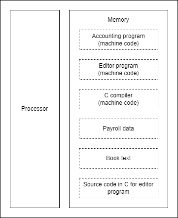

# Computer Organization and Design | *The Hardware/Software Interface*
## Patterson and Hennessy
- [Home](/README.md)
- [Vocab](#vocab)
- [Chapter 1 | *Computer Abstractions and Technology*](#Chapter-1--Computer-Abstractions-and-Technology)
- [Chapter 2 | *Instructions: Language of the computer*](#Chapter-2--Instructions-Language-of-the-computer)


# Chapter 1 | *Computer Abstractions and Technology*
([top](#Computer-Organization-and-Design--The-HardwareSoftware-Interface))
## The Big Picture
> The five classic components of a computer are input, output, memory, datapath, and control, with the last two sometimes combined and called the processor.


> Both hardware and software consist of hierarchical layers using abstraction, with each lower layer hiding details from the level above. One key interface between the levels of abstraction is the *instruction set architecture* - the interface between the hardware and low-level software. This abstract interface enables many *implementations* of varying cost and perfomance to run identical software.

> Always bear in mind that the only complete and reliable measure of computer performance is time. Figure 1.15 shows the basic measurements at different levels in the computer and what is being measured in each case. We can see how these factors are combined to yield execution time measured in seconds per program:
```
Time = Seconds/Program = Instructions/Program X ClockCycles/Instruction X Seconds/clockCycle
```
| Components of Performance | Units of Measure |
|---|---|
|CPU Execution time for a program|Seconds for the program|
|Instruction Count|Instructions executed for the program|
|Clock cycles per instruction (CPI)|Average number of clock cylces per instruction|
|Clock cycle time|Seconds per clock cycle|
<sup>Figure 1.15</sup>

> Execution time is the only valid and unimpeachable measure of performance. Many other metrics have been proposed and found wanting. Sometimes these metrics are flawed from the start by not relfecting execution time; other times a metric that is valid in a limited context is extended and used beyond that context or without the additional clarification needed to make it valid.

# Chapter 2 | *Instructions: Language of the Computer*
([top](#Computer-Organization-and-Design--The-HardwareSoftware-Interface))
### The Big Picture
> Today's computers are built on two key principles:
>   1. Instructions are represented as numbers.
>   2. Programs are stored in memory to be read or written; just like numbers;
> 
> These principles lead to the stored-program concept; its invention let the computing genie out of its bottle. Figure 2.7 shows the power of the concept specifically, memory can contain the source code for an editor program, the corresponding compiled machine code, the text that the compiled program is using, and even the compiler that generated the machine code.


<br>
<sup>Figure 2.7</sup>

### Notes

#### Design Principals
1. *Simplicity favors regularity.*
2. *Smaller is faster.*
3. *Good design demands good compromises.*

#### Bounds Check Shortcut
> Use this shortcut to reduce an index-out-of-bounds check; jumpp to IndexOutOfBounds if $s1 &ge; $t2 or if $s1 is negative
```
sltu $t0, $s1, $t2 # $t0 = 0 if $s1>=length or $s1<0
beq $t0, $zero, IndexOutOfBounds #if bad, goto Error label
```

#### MIPS Register Convention
|Name|Register #|Usage|Reserved on call?|
|:---|:---|:---|:---|
|`$zero`|0|Constant 0|n.a.|
|`$v0-$v1`|2-3|Value results for expression evaluation|no|
|`$a0-$a3`|4-7|Arguments|no|
|`$t0-$t7`|8-15|Temporaries|no|
|`$s0-$s7`|16-23|Saved|yes|
|`$t8-$t9`|24-25|More temporaries|no|
|`$gp`|28|Global pointer|yes|
|`$sp`|29|Stack pointer|yes|
|`$fp`|30|Frame pointer|yes|
|`$ra`|31|Return address|yes|

# Chapter 3 | *Arithmetic for Computers*